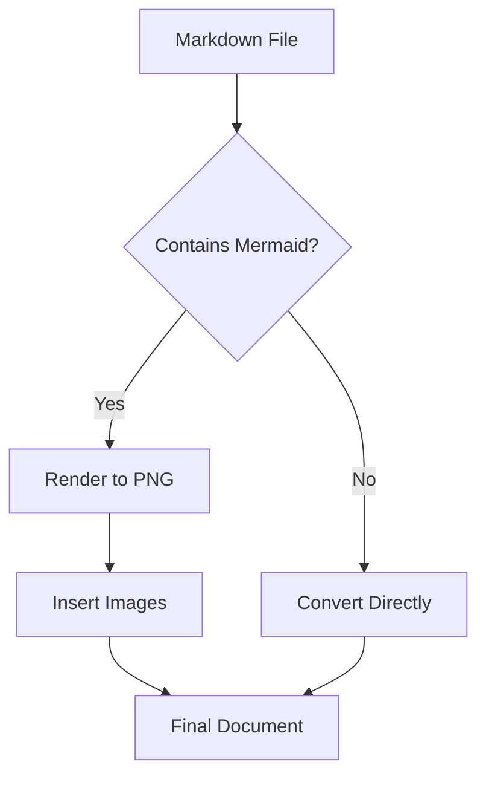

# Mermaid Diagram Rendering Setup

This guide will help you set up Mermaid diagram rendering for the Markdown converter.
🍎
## Prerequisites

The Mermaid rendering pipeline requires:
1. Python packages (already in requirements.txt)
2. Node.js and npm
3. Mermaid CLI

## Installation Steps

### 1. Install Node.js (if not already installed)

**macOS:**
```bash
brew install node
```

**Windows:**
Download and install from [nodejs.org](https://nodejs.org)

**Linux (Ubuntu/Debian):**
```bash
sudo apt update
sudo apt install nodejs npm
```

### 2. Install Mermaid CLI

Once Node.js is installed, install the Mermaid CLI globally:

```bash
npm install -g @mermaid-js/mermaid-cli
```

### 3. Verify Installation

Check that everything is installed correctly:

```bash
# Check Node.js
node --version

# Check npm
npm --version

# Check Mermaid CLI
mmdc --version
```

## How It Works

### For DOCX Conversion:
1. The app detects Mermaid code blocks (````mermaid ... ````)
2. Each diagram is rendered to a PNG image using `mmdc`
3. The code blocks are replaced with placeholders
4. After document creation, images are inserted at placeholder positions

### For PDF Conversion:
1. Mermaid diagrams are rendered to temporary PNG files
2. The Markdown is modified to reference these image files
3. Pandoc processes the Markdown with image references
4. Temporary files are cleaned up after conversion

## Example Mermaid Diagram



## Troubleshooting

### "mmdc command not found"
- Make sure you installed Mermaid CLI globally: `npm install -g @mermaid-js/mermaid-cli`
- Try restarting your terminal/shell

### "Mermaid rendering failed"
- Check that your Mermaid syntax is correct
- Test your diagram at [mermaid.live](https://mermaid.live)
- Ensure you have sufficient permissions to create temporary files

### Performance Issues
- Rendering large or complex diagrams may take a few seconds
- Consider simplifying very complex diagrams

## Disabling Mermaid Rendering

If you don't need Mermaid support or encounter issues, the app will gracefully fall back:
- Mermaid code blocks will be preserved as code blocks in the output
- No rendering will be attempted
- Conversion will proceed normally

## Additional Resources

- [Mermaid Documentation](https://mermaid.js.org/)
- [Mermaid CLI GitHub](https://github.com/mermaid-js/mermaid-cli)
- [Live Editor](https://mermaid.live)
