# Markdown to PDF Converter - Masterplan

**Project:** Obsidian-Compatible Markdown to PDF Converter
**Target:** MCP Server for AI-Generated Markdown Processing
**Status:** Prototype → Production Hardening Phase
**Last Updated:** 2025-12-02

---

## Table of Contents

1. [Executive Summary](#executive-summary)
2. [Current State Assessment](#current-state-assessment)
3. [Feature Inventory](#feature-inventory)
4. [Architecture Overview](#architecture-overview)
5. [Recent Fixes & Lessons Learned](#recent-fixes--lessons-learned)
6. [MCP Service Vision](#mcp-service-vision)
7. [Production Readiness Gaps](#production-readiness-gaps)
8. [Development Priorities](#development-priorities)
9. [Technical Specifications](#technical-specifications)
10. [Success Metrics](#success-metrics)

---

## Executive Summary

### What We're Building

A robust **MCP (Model Context Protocol) server** that converts Markdown files to professionally-formatted PDFs, with special support for:
- Obsidian-specific syntax (callouts, extended checkboxes, wikilinks)
- AI-generated markdown (handling inconsistent formatting)
- Customizable headers/footers with template system
- Professional styling (blockquotes, code blocks, diagrams)
- Unicode/emoji support via LuaLaTeX

### Current Status

```mermaid
graph LR
    A[Prototype] --> B[Core Features ✅]
    A --> C[Production Gaps ⚠️]
    B --> D[Next: Testing & Hardening]
    C --> D
    D --> E[MCP Service 🎯]

    style B fill:#90EE90
    style C fill:#FFB6C1
    style E fill:#87CEEB
```



**✅ Core Pipeline Working:**
- Markdown → Obsidian preprocessing → Pandoc → LuaLaTeX → PDF
- Template system for headers/footers
- Robust handling of formatting edge cases

**⚠️ Production Gaps:**
- No systematic testing
- Limited error handling
- No input validation
- Missing fallback mechanisms
- Undocumented supported features

### Next Milestone

**Production-Ready MCP Server** with comprehensive testing, error handling, and monitoring.

### Project Timeline

| Phase | Duration | Status | Key Deliverables |
|-------|----------|--------|------------------|
| **Discovery & Prototyping** | Completed | ✅ | Core pipeline, Obsidian support, template system |
| **Bug Fixing & Hardening** | Completed | ✅ | 7+ edge case fixes, robust preprocessing |
| **Testing Infrastructure** | 1 week | 🔄 Next | Test suite, fixtures, CI/CD |
| **Error Handling** | 1 week | ⏳ | Try/catch, timeouts, fallbacks |
| **Production Hardening** | 2 weeks | ⏳ | Validation, monitoring, docs |
| **MCP Service Launch** | 1 week | ⏳ | API, deployment, monitoring |

---

## Current State Assessment

### What We Have Built


### Core Components

| Component | File | Responsibility |
|-----------|------|----------------|
| **Obsidian Preprocessor** | `helpers/obsidian_preprocessor.py` | Convert Obsidian → Standard Markdown, fix formatting |
| **PDF Converter** | `helpers/pdf_converter.py` | Pandoc wrapper, LuaLaTeX config, file management |
| **Header/Footer Processor** | `helpers/header_footer_processor.py` | Variable substitution, LaTeX generation |
| **Template Manager** | `helpers/template_manager.py` | Load templates, manage presets |
| **Templates** | `config/header_footer_template.json` | Predefined styling presets |

### Technology Stack


---

## Feature Inventory

### ✅ Implemented Features

#### Obsidian Syntax Support

| Feature | Status | Implementation | Example |
|---------|--------|----------------|---------|
| **Callouts** | ✅ Complete | LaTeX tcolorbox | `> [!note] Title` |
| **Extended Checkboxes** | ✅ Complete | 40+ emoji types | `- [x]`, `- [!]`, `- [?]` |
| **Wikilinks** | ✅ Complete | Standard links | `[[page]]` → `[page](page)` |
| **Image Embeds** | ✅ Complete | Path resolution | `![[image.png]]` |
| **Highlighting** | ✅ Complete | LaTeX soul | `==text==` |
| **Underline** | ✅ Complete | LaTeX ulem | `<u>text</u>` |

#### Formatting Fixes Journey

```mermaid
timeline
    title Bug Fixes & Feature Development

    Issue 1 : Emoji Support
            : LuaLaTeX engine ✅

    Issue 2 : Code Block Overflow
            : listings package ✅

    Issue 3 : Page Number Format
            : Non-breaking spaces ✅

    Issue 4 : Code Indent
            : breakindent=0pt ✅

    Issue 5 : Blockquote Style
            : framed package ✅

    Issue 6 : Header Line Breaks
            : mbox wrapping ✅

    Issue 7 : List Blank Lines
            : Auto-insertion ✅
```



#### Formatting Fixes Detailed

| Issue | Problem | Solution | Status |
|-------|---------|----------|--------|
| **Emoji Support** | Blank boxes | LuaLaTeX engine | ✅ |
| **Code Overflow** | Text truncated | `listings` + `breaklines` | ✅ |
| **Page Numbers** | "1of2" squished | `~` + `\mbox{}` | ✅ |
| **Code Indent** | Hanging indent | `breakindent=0pt` | ✅ |
| **Blockquotes** | Plain indented text | `framed` + styling | ✅ |
| **Header Breaks** | Vertical word stacking | `\mbox{}` wrapper | ✅ |
| **List Recognition** | Inline text rendering | Auto blank line insertion | ✅ |

#### Header/Footer System

**Supported Variables:**

| Variable Type | Variables | Example |
|---------------|-----------|---------|
| **Time/Date** | `{current_date}`, `{current_time}` | `2025-12-02`, `14:30` |
| **Pagination** | `{page}`, `{total}` | `Page 1 of 13` |
| **Metadata** | `{title}`, `{author}`, `{company}` | From frontmatter |
| **Custom** | Any frontmatter key | User-defined |

**Template Presets:**

| Preset | Use Case | Features |
|--------|----------|----------|
| **Simple** | Minimal docs | Page numbers only |
| **Corporate** | Business reports | Logo, company info, formal styling |
| **Academic** | Research papers | Citations, formal headers |
| **Custom** | User-defined | Full customization |

### 🚧 Feature Status Summary


| Status | Features | Count |
|--------|----------|-------|
| ✅ **Complete** | Obsidian syntax (6), Formatting fixes (7), Templates (4) | 17 |
| 🟡 **Partial** | Error handling, Validation, Logging, Config | 4 |
| ❌ **Missing** | Testing, Monitoring, Docs, Security | 4 |

---

## Architecture Overview

### Current Architecture


### Preprocessing Pipeline Flow


### Data Flow


---

## Recent Fixes & Lessons Learned

### Problem-Solving Journey


### Key Insights


| # | Insight | Implication |
|---|---------|-------------|
| **1** | AI markdown is inconsistent | Need aggressive preprocessing |
| **2** | LaTeX has environment-specific behaviors | Can't assume one fix works everywhere |
| **3** | Multiple levels of processing | Issues can occur in template, variables, or LaTeX |
| **4** | Iterative hardening works | Each fix makes system more robust |
| **5** | But risks regressions | **Need systematic testing** |

---

## MCP Service Vision

### What is the MCP Server?

**Model Context Protocol (MCP)** allows AI agents to invoke external services. Our server exposes markdown-to-PDF conversion as an API endpoint.

### Use Case Flow


### API Design

#### Request Schema

```json
{
  "markdown_content": "# Title\n\nContent...",
  "options": {
    "template": "corporate",
    "variables": {
      "title": "Quarterly Report",
      "author": "AI Assistant",
      "company": "Acme Corp"
    },
    "config": {
      "page_size": "letter",
      "margin": "0.75in",
      "include_toc": false
    }
  }
}
```

#### Response Schema

```json
{
  "success": true,
  "pdf_base64": "JVBERi0xLjcKJeLjz9MK...",
  "warnings": [
    "Line 42: Unsupported callout type 'custom'"
  ],
  "metadata": {
    "pages": 13,
    "processing_time_ms": 2341,
    "file_size_bytes": 245678,
    "engine_used": "pandoc-lualatex"
  }
}
```

### Service Architecture

```mermaid
graph TB
    subgraph "MCP Server Layer"
        A[API Endpoint] --> B[Request Validator]
        B --> C[Rate Limiter]
        C --> D[Auth Check]
    end

    subgraph "Conversion Service"
        D --> E[Input Normalizer]
        E --> F[Preprocessor]
        F --> G{Try Engines}
        G -->|Primary| H[Pandoc + LuaLaTeX]
        G -->|Fallback 1| I[Pandoc + pdfLaTeX]
        G -->|Fallback 2| J[Weasyprint]
        G -->|Last Resort| K[HTML→PDF]
    end

    subgraph "Support Services"
        L[Error Handler]
        M[Logger]
        N[Metrics Collector]
    end

    H --> O[Success]
    I --> O
    J --> O
    K --> O

    G -.on error.-> L
    E -.log.-> M
    O -.track.-> N

    style A fill:#E1F5FF
    style O fill:#C8E6C9
    style L fill:#FFB6C1
```



### Fallback Strategy

```mermaid
flowchart TD
    Start[Input Markdown] --> V{Validate}
    V -->|Invalid| E1[Return Error]
    V -->|Valid| P1[Try Pandoc + LuaLaTeX]

    P1 -->|Success| S1[Full Features ✅]
    P1 -->|Fail| P2[Try Pandoc + pdfLaTeX]

    P2 -->|Success| S2[No Unicode ⚠️]
    P2 -->|Fail| P3[Try Weasyprint]

    P3 -->|Success| S3[Simpler Styling ⚠️]
    P3 -->|Fail| P4[Try HTML→PDF]

    P4 -->|Success| S4[Basic Output ⚠️]
    P4 -->|Fail| E2[Generate Error PDF]

    S1 --> Return[Return Result]
    S2 --> Return
    S3 --> Return
    S4 --> Return
    E2 --> Return

    style S1 fill:#90EE90
    style S2 fill:#FFEB3B
    style S3 fill:#FFEB3B
    style S4 fill:#FFEB3B
    style E1 fill:#F44336
    style E2 fill:#F44336
```



---

## Production Readiness Gaps

### Critical Issues


### Gap Analysis

| Category | Current State | Required State | Priority |
|----------|---------------|----------------|----------|
| **Testing** | None | 80%+ coverage | 🔴 P1 |
| **Error Handling** | Basic exceptions | Try/catch + fallbacks | 🔴 P1 |
| **Input Validation** | None | Size limits + sanitization | 🔴 P1 |
| **Timeouts** | None | 30s max | 🔴 P1 |
| **Logging** | Print statements | Structured logging | 🔴 P1 |
| **Monitoring** | None | Metrics + alerts | 🟡 P2 |
| **Configuration** | Hardcoded | Config file + env vars | 🟡 P2 |
| **Documentation** | None | API docs + user guide | 🟡 P2 |
| **Fallbacks** | None | Multi-engine support | 🟡 P2 |
| **Caching** | None | Content hash caching | 🟢 P3 |

### Risk Assessment

```mermaid
quadrantChart
    title Production Readiness Risk Matrix
    x-axis Low Impact --> High Impact
    y-axis Low Probability --> High Probability
    quadrant-1 Critical (Fix Now)
    quadrant-2 Monitor
    quadrant-3 Accept
    quadrant-4 Mitigate

    Testing Gaps: [0.8, 0.9]
    Error Handling: [0.85, 0.85]
    Input Validation: [0.7, 0.8]
    No Timeouts: [0.65, 0.75]
    No Monitoring: [0.5, 0.6]
    No Caching: [0.3, 0.3]
    No Docs: [0.4, 0.5]
```

---

## Development Priorities

### Overall Timeline


### Priority 1: Critical for Production (Weeks 1-4)

#### 1.1 Testing Infrastructure (Week 1)

**Effort:** 5 days | **Priority:** 🔴 Critical

| Task | Days | Deliverable |
|------|------|-------------|
| Setup pytest framework | 0.5 | `pyproject.toml`, `pytest.ini` |
| Create fixture structure | 0.5 | `tests/fixtures/` directory |
| Unit tests - preprocessing | 1.5 | `test_obsidian_preprocessor.py` |
| Unit tests - headers/footers | 1 | `test_header_footer.py` |
| Integration tests | 1 | `test_full_pipeline.py` |
| CI/CD setup | 0.5 | GitHub Actions workflow |

**Test Coverage Target:**


---

#### 1.2 Error Handling & Recovery (Week 2)

**Effort:** 6 days | **Priority:** 🔴 Critical


| Task | Days | Deliverable |
|------|------|-------------|
| Create ConversionResult dataclass | 0.5 | Type definitions |
| Wrap Pandoc calls with try/catch | 1 | Error handling in `pdf_converter.py` |
| Implement timeout handling | 1 | Process timeout with cleanup |
| Build fallback engine chain | 2 | Multi-engine support |
| Error PDF generation | 1 | Minimal PDF with error details |
| Integration & testing | 0.5 | Updated test suite |

---

#### 1.3 Input Validation & Security (Week 3)

**Effort:** 4 days | **Priority:** 🔴 Critical

**Security Threat Model:**


| Task | Days | Deliverable |
|------|------|-------------|
| Design validation framework | 0.5 | Validator class architecture |
| Implement size limits | 0.5 | Content, image, page limits |
| LaTeX command sanitization | 1 | Blacklist + whitelist |
| Path sanitization | 0.5 | Remove traversal attempts |
| Timeout enforcement | 1 | Process killing |
| Security test suite | 0.5 | Malicious input tests |

---

#### 1.4 Logging & Basic Monitoring (Week 4)

**Effort:** 3 days | **Priority:** 🔴 Critical


| Task | Days | Deliverable |
|------|------|-------------|
| Setup structlog | 0.5 | Logging configuration |
| Replace print() statements | 1 | Structured logging everywhere |
| Add timing metrics | 0.5 | Duration tracking |
| Basic metrics collection | 0.5 | Counters, histograms |
| Create dashboard | 0.5 | Grafana dashboard (optional) |

---

### Priority 2: Important for Reliability (Weeks 5-8)

#### 2.1 Configuration System (Week 5)

**Effort:** 3 days

| Component | Configuration |
|-----------|---------------|
| **Conversion** | timeout, max_file_size, max_images |
| **LaTeX** | engine, margin, page_size |
| **Preprocessing** | toggle each step on/off |
| **Security** | allowed commands, path rules |
| **Performance** | cache settings, concurrency |

---

#### 2.2 Normalization Layer (Week 6)

**Effort:** 7 days

**Current vs. Proposed:**

```mermaid
graph LR
    subgraph "Current: Many Small Fixes"
        A[Raw Markdown] --> B[Fix Lists]
        B --> C[Fix Headers]
        C --> D[Fix Callouts]
        D --> E[Fix Checkboxes]
        E --> F[...]
    end

    subgraph "Proposed: Normalize First"
        G[Raw Markdown] --> H[Parse to AST]
        H --> I[Normalize to CommonMark]
        I --> J[Convert Obsidian]
        J --> K[Output Clean Markdown]
    end

    style I fill:#90EE90
```

---

#### 2.3 Alternative Rendering Engines (Week 7)

**Effort:** 5 days

**Engine Comparison:**

| Engine | Features | Speed | Reliability | Unicode |
|--------|----------|-------|-------------|---------|
| **Pandoc + LuaLaTeX** | ⭐⭐⭐⭐⭐ | ⭐⭐⭐ | ⭐⭐⭐ | ✅ |
| **Pandoc + pdfLaTeX** | ⭐⭐⭐⭐ | ⭐⭐⭐⭐ | ⭐⭐⭐⭐ | ❌ |
| **Weasyprint** | ⭐⭐⭐ | ⭐⭐⭐⭐⭐ | ⭐⭐⭐⭐⭐ | ✅ |
| **HTML→PDF** | ⭐⭐ | ⭐⭐⭐⭐⭐ | ⭐⭐⭐⭐⭐ | ✅ |

---

#### 2.4 API Documentation (Week 8)

**Effort:** 4 days

**Documentation Structure:**

```mermaid
mindmap
  root((Documentation))
    API Reference
      OpenAPI Spec
      Request/Response
      Error Codes
    User Guide
      Getting Started
      Templates
      Variables
      Examples
    Developer Guide
      Architecture
      Extending
      Contributing
    Feature Matrix
      Supported Syntax
      Limitations
      Roadmap
```

---

### Priority 3: Nice to Have (Weeks 9-12)

#### Priority Summary Table

| Priority | Focus Area | Duration | Key Outcomes |
|----------|-----------|----------|--------------|
| **P1** | Production Readiness | 4 weeks | Testing, error handling, security, logging |
| **P2** | Reliability & Maintainability | 4 weeks | Config, normalization, alternatives, docs |
| **P3** | Optimization & Enhancement | 4 weeks | Performance, caching, advanced features |

---

## Technical Specifications

### System Requirements

| Component | Requirement | Version |
|-----------|-------------|---------|
| **Python** | Required | 3.9+ |
| **Pandoc** | Required | 2.19+ |
| **TeX Live** | Required | 2023+ (with LuaLaTeX) |
| **Redis** | Optional (caching) | 7.0+ |
| **Prometheus** | Optional (metrics) | 2.40+ |

### Performance Targets

```mermaid
graph TB
    subgraph "Response Time Targets"
        A[Small <10KB] --> A1[<2s]
        B[Medium 100KB] --> B1[<5s]
        C[Large 1MB] --> C1[<30s]
    end

    subgraph "Quality Targets"
        D[Success Rate] --> D1[>95%]
        E[P95 Latency] --> E1[<10s]
        F[Uptime] --> F1[>99.5%]
    end

    style A1 fill:#90EE90
    style B1 fill:#90EE90
    style C1 fill:#FFEB3B
    style D1 fill:#90EE90
    style E1 fill:#90EE90
    style F1 fill:#90EE90
```

| Metric | Target | Rationale |
|--------|--------|-----------|
| **Small document** (<10KB) | <2s | Interactive feel |
| **Medium document** (100KB) | <5s | Acceptable wait |
| **Large document** (1MB) | <30s | Max timeout |
| **Success rate** | >95% | High reliability |
| **P95 latency** | <10s | User experience |
| **Memory usage** | <500MB/conversion | Resource efficiency |
| **Concurrent conversions** | 5-10 | Reasonable throughput |

### Resource Limits

```python
LIMITS = {
    # Input validation
    'max_content_size_bytes': 10_000_000,      # 10MB
    'max_images': 100,
    'max_pages': 500,

    # Processing limits
    'timeout_seconds': 30,
    'max_template_recursion': 10,
    'max_concurrent_conversions': 5,

    # Security
    'rate_limit_per_minute': 60,
    'max_file_path_length': 255,
}
```

### Security Threat Matrix

| Threat | Severity | Mitigation | Status |
|--------|----------|------------|--------|
| **LaTeX Injection** | 🔴 High | Command blacklist | ⏳ P1 |
| **Path Traversal** | 🔴 High | Path sanitization | ⏳ P1 |
| **DoS: Large Files** | 🟡 Medium | Size limits | ⏳ P1 |
| **DoS: Timeout** | 🟡 Medium | Process timeout | ⏳ P1 |
| **Resource Exhaustion** | 🟡 Medium | Rate limiting | ⏳ P2 |
| **XSS in PDF** | 🟢 Low | PDF format limitations | ✅ N/A |

---

## Success Metrics

### Technical KPIs

```mermaid
graph TB
    subgraph "Code Quality"
        A[Test Coverage] --> A1[">80%"]
        B[Type Coverage] --> B1[">90%"]
        C[Linter Score] --> C1["0 errors"]
    end

    subgraph "Performance"
        D[P50 Latency] --> D1["<3s"]
        E[P95 Latency] --> E1["<10s"]
        F[P99 Latency] --> F1["<20s"]
    end

    subgraph "Reliability"
        G[Success Rate] --> G1[">95%"]
        H[Uptime] --> H1[">99.5%"]
        I[Error Rate] --> I1["<5%"]
    end

    style A1 fill:#90EE90
    style B1 fill:#90EE90
    style C1 fill:#90EE90
    style D1 fill:#90EE90
    style E1 fill:#90EE90
    style F1 fill:#FFEB3B
    style G1 fill:#90EE90
    style H1 fill:#90EE90
    style I1 fill:#90EE90
```

### Monitoring Dashboard

| Metric | Current | Target | Status |
|--------|---------|--------|--------|
| **Test Coverage** | 0% | >80% | 🔴 |
| **Success Rate** | Unknown | >95% | 🔴 |
| **P95 Latency** | Unknown | <10s | 🔴 |
| **Error Rate** | Unknown | <5% | 🔴 |
| **Uptime** | Unknown | >99.5% | 🔴 |
| **API Docs** | None | Complete | 🔴 |

### Business Metrics

| Metric | Measurement | Goal |
|--------|-------------|------|
| **Conversion Volume** | Conversions/day | Track growth |
| **User Satisfaction** | Warnings per conversion | <2 warnings average |
| **Feature Adoption** | Template usage | Identify popular templates |
| **Error Patterns** | Top 10 errors | Guide improvements |

---

## Appendix A: Current File Structure

```mermaid
graph TD
    A[Project Root] --> B[main.py]
    A --> C[helpers/]
    A --> D[config/]
    A --> E[tests/]
    A --> F[MASTERPLAN.md]

    C --> C1[obsidian_preprocessor.py]
    C --> C2[pdf_converter.py]
    C --> C3[header_footer_processor.py]
    C --> C4[template_manager.py]

    D --> D1[header_footer_template.json]
    D --> D2[logo.png]

    E --> E1[Pages Overflow.md]
    E --> E2[quotes.md]
    E --> E3[Switzerland AI....md]
```

---

## Appendix B: Preprocessing Function Reference

| Function | Input Pattern | Output Pattern | Purpose |
|----------|---------------|----------------|---------|
| `fix_consecutive_bold_lines()` | `**Label1:**\n**Label2:**` | `**Label1:**\n\\\n**Label2:**` | Add line breaks |
| `fix_list_blank_lines()` | `Text:\n- Item` | `Text:\n\n- Item` | Pandoc list recognition |
| `convert_callouts()` | `> [!note] Title` | `\begin{calloutNote}{Title}` | LaTeX callout boxes |
| `convert_obsidian_images()` | `![[image.png]]` | `` | Standard syntax |
| `convert_wikilinks()` | `[[Page]]` | `[Page](Page)` | Standard links |
| `convert_extended_checkboxes()` | `- [x]`, `- [!]` | Emoji icons | 40+ types |
| `convert_highlighting()` | `==text==` | `\hl{text}` | LaTeX highlight |
| `convert_underline()` | `<u>text</u>` | `\uline{text}` | LaTeX underline |

---

## Appendix C: LaTeX Packages Used

```mermaid
mindmap
  root((LaTeX Packages))
    Text & Fonts
      fontspec
      microtype
      parskip
    Layout
      fancyhdr
      lastpage
      geometry
      float
    Graphics
      graphicx
      xcolor
    Lists
      enumitem
    Code
      listings
      fancyvrb
    Boxes
      tcolorbox
      framed
```

| Package | Purpose | Critical |
|---------|---------|----------|
| `fontspec` | Font config (LuaLaTeX) | ✅ Yes |
| `fancyhdr` | Headers/footers | ✅ Yes |
| `lastpage` | Total page count | ✅ Yes |
| `graphicx` | Images/logos | ✅ Yes |
| `xcolor` | Colors | ✅ Yes |
| `tcolorbox` | Callout boxes | ✅ Yes |
| `enumitem` | List formatting | ✅ Yes |
| `listings` | Code blocks | ✅ Yes |
| `framed` | Blockquotes | ✅ Yes |
| `microtype` | Typography | No |
| `parskip` | Paragraph spacing | No |
| `float` | Figure placement | No |

---

## Appendix D: Known Limitations

| Limitation | Workaround | Priority to Fix |
|------------|-----------|-----------------|
| **Mermaid diagrams** | External rendering required | 🟡 P2 |
| **SVG logos** | Convert to PNG | 🟢 P3 |
| **Complex tables** | Simplify structure | 🟢 P3 |
| **Unicode math** | Limited font support | 🟢 P3 |
| **Interactive elements** | PDF format limitation | N/A |
| **Real-time collaboration** | Not supported | 🟢 P3 |

---

## Appendix E: Roadmap Beyond P3

```mermaid
timeline
    title Future Enhancements (Year 1+)

    Q1 2026 : Template Editor UI
          : Batch Processing
          : Cloud Storage Integration

    Q2 2026 : Webhook Support
          : Version Control
          : A/B Testing Framework

    Q3 2026 : Machine Learning
          : Auto-engine selection
          : Pattern detection

    Q4 2026 : Distributed Processing
          : Multi-region deployment
          : Advanced caching
```

| Feature | Description | Business Value |
|---------|-------------|----------------|
| **Template Editor UI** | Visual customization | Easier for non-technical users |
| **Batch Processing** | Multiple files at once | Enterprise use cases |
| **Cloud Storage** | S3, Drive integration | Seamless workflows |
| **Webhooks** | Event-driven conversions | Automation |
| **Version Control** | Template versioning | Team collaboration |
| **ML Auto-detection** | Smart engine selection | Better quality |
| **Distributed Processing** | Scale across servers | High throughput |

---

**Document Version:** 2.0 (with Mermaid diagrams)
**Last Updated:** 2025-12-02
**Next Review:** After P1 completion
