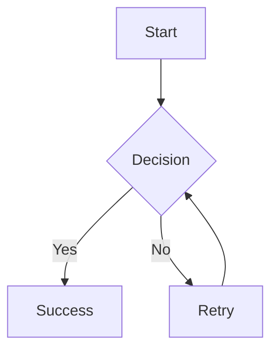

# Test Document

## Features Test

### 1. Lists
- Bullet point 1
- Bullet point 2
  - Nested item
  - Another nested

1. Numbered item
2. Second item

### 2. Code Block
```python
def hello_world():
    print("Hello from code block!")
    return 42
```

### 3. Table
| Feature | Status |
|---------|--------|
| Tables  | ✅     |
| Math    | ✅     |
| Diagrams| ✅     |

### 4. LaTeX Math
Inline math: $E = mc^2$

Block math:
$$\frac{-b \pm \sqrt{b^2-4ac}}{2a}$$

### 5. Mermaid Diagram


### 6. Checkboxes
- [x] Completed task
- [ ] Pending task
- [ ] Another task

### 7. Links & Images
[GitHub](https://github.com)

**Bold text** and *italic text* and ~~strikethrough~~
