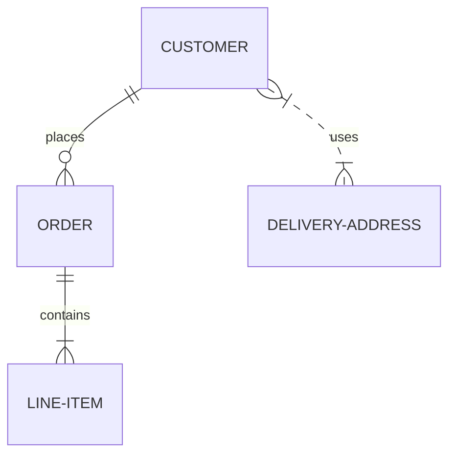
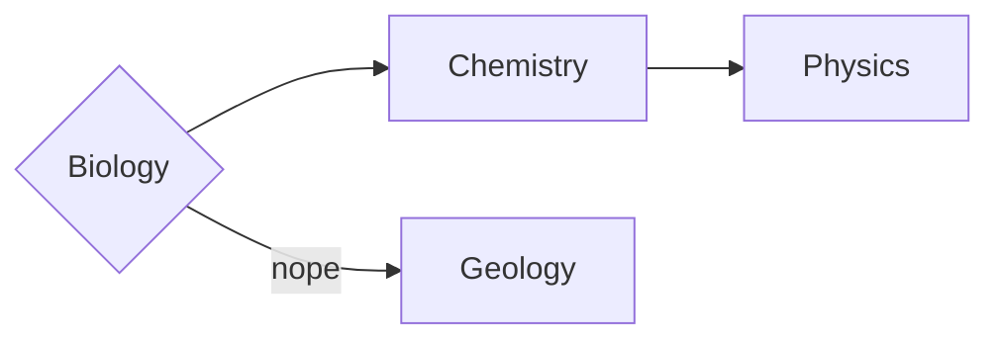
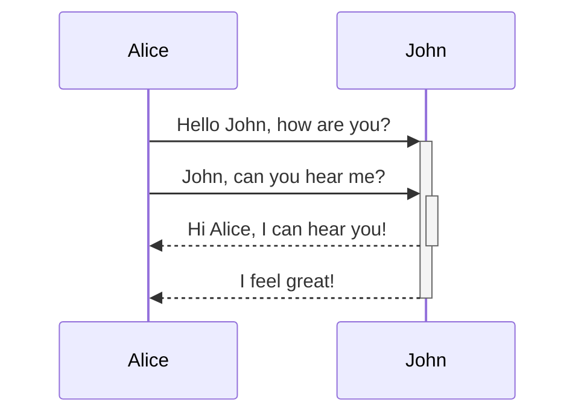
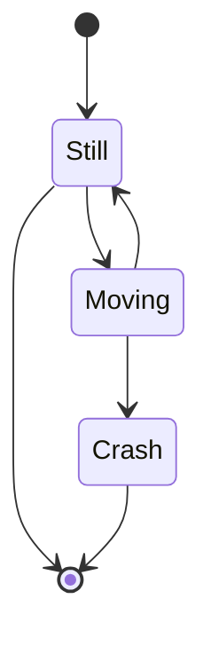
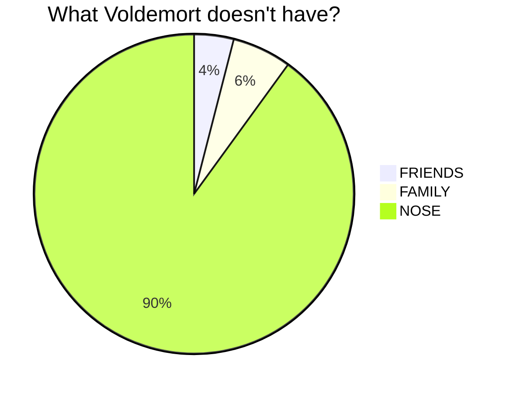
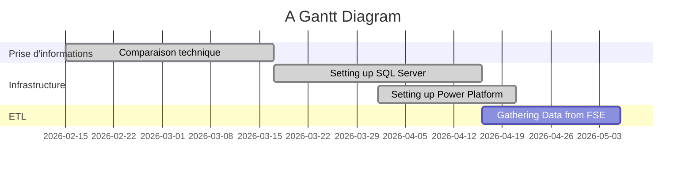

---
tags:
  - formatting
  - obsidian
  - mermaid
  - markdown
banner: "https://photographypro.com/wp-content/uploads/2018/01/shoot-panoramic-photos-2.jpg"
banner_y: 0.20398
---
Back [[Expediting - Home]]

# Contents
1. [Obsidian Formatting](#Obsidian%20Formatting)
2. [Images](#Images)
3. [Titres](#Titres)
4. [Titre 1](#Titre%201)
	1. [Titre 2](#Titre%202)
		1. [Titre 3](#Titre%203)
5. [Forme générale du texte](#Forme%20g%C3%A9n%C3%A9rale%20du%20texte)
	1. [Texte](#Texte)
	2. [Listes](#Listes)
		1. [Simple Lists](#Simple%20Lists)
		2. [Check boxes](#Check%20boxes)
6. [Tables](#Tables)
7. [Code blocks](#Code%20blocks)
8. [Mermaid Stuff](#Mermaid%20Stuff)
	1. [Entity Relationship Diagram](#Entity%20Relationship%20Diagram)
	2. [Flowchart](#Flowchart)
	3. [Sequence Diagram](#Sequence%20Diagram)
	4. [Latex Math](#Latex%20Math)
9. [State Diagrams](#State%20Diagrams)
10. [Pie Charts](#Pie%20Charts)
11. [Callouts](#Callouts)
		1. [Exemple of a code exemple in R](#Exemple%20of%20a%20code%20exemple%20in%20R)
12. [Gantt Diagrams](#Gantt%20Diagrams)


# Obsidian Formatting

Cette note contient les bases du formatting d'Obsidian

# Images

![[LogoVulcain.png|center]] 


___
# Titres

```
# Titre 1 
## Titre 2
### Titre 3
#### Titre 4
##### Titre 5
###### Titre 6
```
# Titre 1 
## Titre 2
### Titre 3
#### Titre 4
##### Titre 5
###### Titre 6

___
# Forme générale du texte
## Texte

Normal ***Gras Italique***    **Gras**    *ITalique*    ==Marqueur==    ~~Strikethrough~~    `in line code`    [Link](link)    <u>Underline</u>

Downpage note [^1]

[^1]: Downpage note extension

Section link
![[Expediting - Home#^Regles]]


> Quote
 
---
## Listes
### Simple Lists
 - List
 - List

1. List 
2. List
	1. Embed

### Check boxes

- [ ] Tick box
- [x] Ticked box
    - [ ] Embed me please
    - [x]  Oh yeah
        - [ ] Testing
        - [x]  PLop
            - [ ] Testing
            - [x]  PLop
                - [ ] Testing
                - [x]  PLop
                    - [ ] Testing
                    - [x]  PLop
--- 

### Types of check boxes
- [ ] Unchecked 
- [x] Regular 
- [X] Checked 
- [-] Dropped 
- [>] Forward 
- [D] Date 
- [x] Question 
- [/]  Half Done
- [+] Add 
- [R] Research 
- [!] Important 
- [i] Idea 
- [B] Brainstorm 
- [P] Pro 
- [C] Con 
- [Q] Quote 
- [N] Note 
- [b] Bookmark 
- [I] Information 
- [p] Paraphrase 
- [L] Location 
- [E] Example 
- [A] Answer 
- [r] Reward 
- [c] Choice 
- [d] Doing
- [T] Time 
- [@] Character / Person
- [t] Talk
- [O] Outline / Plot 
- [~] Conflict 
- [W] World 
- [f] Clue / Find 
- [F] Foreshadow 
- [H] Favorite / Health 
- [&] Symbolism 
- [s] Secret
---
# Tables

| Table | Hey |
| ------- | ------ |
| Yay | Check|

| First name | Last name |
| ---------- | --------- |
| Max        | Planck    |
| Marie      | Curie     |
| hello      | world     |
|            |           |

---
# Code blocks
eee
~~~ 
Code block with Tildes 
~~~ 

``` 
Code Block with ticks 
``` 

    Code Block with four spaces

---
# Mermaid Stuff

## Entity Relationship Diagram
Basics of Relation design
**Note** : Relationships types disappear in read mode.
	v--> --> - - > --> <-- 
	| | - - o { 


---
## Flowchart

This code 
	```mermaid 
	graph LR 
	A{Biology} --> Chemistry
	A -- nope --> Geology
	Chemistry --> Physics 
	```
will render this chart



---
## Sequence Diagram
This code 
	```mermaid 
	sequenceDiagram 
	Alice->>+John: Hello John, how are you? 
	Alice->>+John: John, can you hear me? 
	John-->>-Alice: Hi Alice, I can hear you! 
	John-->>-Alice: I feel great! 
	```
Will render this chart

--- 

## Latex Math
This code with double $
	\begin{vmatrix} 
	a & b\\ c & d \
	end{vmatrix}=ad-bc
Will generate:
$$ \begin{vmatrix} 
a & b\\ c & d 
\end{vmatrix}
=ad-bc $$
This is an inline math expression $e^{2i\pi} = 1$. It is used with a single $, exemples : $x = 3$ , $a^2 + b^2 = a^2 + ab + b^2$
$$\int_{a}^b\int_{c}^d f(x,y)dxdy$$


---
# State Diagrams





---
# Pie Charts




---
# Callouts

     > [!note] title
     > text in callout
  
> [!note] note

> [!todo] info todo

> [!tldr] abstract summary tldr

> [!attention] tip hint important

> [!success] success check done

> [!question] question help faq
> test


> [!warning] warning caution attention

> [!fail] failure fail missing
> attention, au passage du train...

> [!danger] danger error

> [!bug] bug

> [!example] example

> [!quote] quote cite


> [!question] Can callouts be nested? 
> > [!todo] Yes!, they can. 
> > > [!example] You can even use multiple layers of nesting


## [All Obsidian Callouts](https://notes.nicolevanderhoeven.com/Obsidian+Callouts)


## Exemple of a code exemple in R

>[!exemple] Syntaxe mise en lumière pour R
>Exemple de code trouvé sur internet :
>
>
>```R
>help(*)
>
> > x <- 1 
> > mode(x) [1] 
"numeric" 
> > length(x) 
[1] 1 
> > A <- "Gomphotherium"; compar <- TRUE; z <- 1i 
> > mode(A); mode(compar); mode(z) [1] 
"character" [1] 
"logical" [1] 
"complex"
>
>```

---
# Gantt Diagrams


