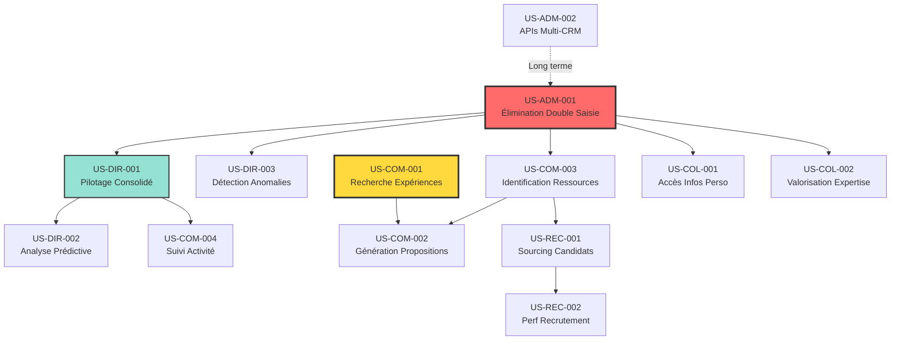

# User Stories PEPPER - Détails

**Date:** 2025-12-03
**Version:** 1.0
**Owner:** Eric TAYLOR, CAIO Infogene
**Scope:** Spécifications détaillées des besoins utilisateurs pour la plateforme PEPPER

**Document lié:** [Masterplan Pepper - DAF.md](./Masterplan%20Pepper%20-%20DAF.md)

---

## Vue d'Ensemble

Ce document détaille l'ensemble des User Stories pour la plateforme PEPPER (Platform for Enhanced Performance, Planning & Engagement Resources), organisées par type d'utilisateur et priorisées selon leur valeur métier.

**Écosystème de données source:**

- **Boond Manager** : ERP/CRM/CVthèque (52k candidats, 10.5k sociétés, 81k contacts)
- **MyActivity** : Pilotage commercial et disponibilités temps réel
- **MyInfogene** : Portail collaborateur/client, fiches projets, référents techniques (50+)
- **Palantir** : Middle-office, analyses financières, algorithme prédictif CA/Marge
- **Esinfogene** : Agrégation CVs job boards

\newpage

## 1. User Stories - Direction et DAF

### US-DIR-001 : Pilotage Activité Consolidé

**En tant que** Directeur Général / DAF
**Je veux** avoir une vue consolidée temps réel de l'activité (CA, Marge, projets, ressources) depuis tous les systèmes (Boond, MyActivity, Palantir, MyInfogene)
**Afin de** prendre des décisions stratégiques éclairées et piloter efficacement l'entreprise

**Critères d'acceptation:**

- Dashboard unique consolidant données de Boond Manager, MyActivity, Palantir
- Indicateurs clés : CA réalisé/prévisionnel, Marge par BU/Commercial, Taux d'occupation
- Rafraîchissement temps réel ou quotidien
- Export Excel/PDF des analyses
- Alertes sur écarts significatifs vs objectifs

**Valeur métier:** Gain de temps direction : 4-5h/semaine en recherche et consolidation manuelle

**Priorité:** P0 (Critique)
**Phase:** Phase 1 (Q1 2025)
**Complexité:** Moyenne (5 jours dev)
**Sources de données:** Palantir, MyActivity, Boond Manager

**Scénarios d'usage:**

1. Directeur consulte dashboard chaque lundi matin pour préparation CODIR
2. DAF exporte analyses mensuelles pour reporting groupe
3. Contrôleur de gestion reçoit alertes écarts > 10% vs objectifs

**Tests d'acceptation:**

- [ ] Dashboard affiche CA/Marge du mois en cours avec écart vs budget
- [ ] Données rafraîchies quotidiennement avant 8h
- [ ] Export Excel conserve formules et graphiques
- [ ] Alertes envoyées par email dans les 15 minutes de détection

---

\newpage

### US-DIR-002 : Analyse Prédictive CA/Marge

**En tant que** DAF / Contrôleur de Gestion
**Je veux** accéder à des projections fiables du CA et de la Marge pour les mois/années à venir
**Afin de** anticiper la trésorerie, optimiser les ressources et identifier les leviers de rentabilité

**Critères d'acceptation:**

- Algorithme prédictif basé sur historique Palantir (typologie collaborateurs, activités)
- Projection CA/Marge par Commercial, BU, et global Infogene
- Scénarios multiples (pessimiste, réaliste, optimiste)
- Identification automatique des projets les plus rentables à dupliquer
- Interface conversationnelle : "Quel sera notre CA au T2 2025 si nous gagnons le projet X ?"

**Valeur métier:** Amélioration prédictibilité trésorerie, optimisation marge +5-10%

**Priorité:** P0 (Critique)
**Phase:** Phase 2 (Q2 2025)
**Complexité:** Haute (15 jours dev)
**Sources de données:** Palantir (algorithme prédictif existant), Boond Manager (projets en cours)

**Scénarios d'usage:**

1. DAF prépare prévisionnel budgétaire N+1 en analysant projections
2. Directeur simule impact gain d'un gros contrat sur CA annuel
3. Manager BU identifie projets rentables à reproduire pour optimiser marge

**Tests d'acceptation:**

- [ ] Projections générées avec écart < 10% vs réalisé sur historique 2024
- [ ] 3 scénarios affichés : pessimiste (-15%), réaliste, optimiste (+15%)
- [ ] Requête conversationnelle retourne projection en < 5 secondes
- [ ] Top 10 projets rentables identifiés avec ROI > 20%

---

\newpage

### US-DIR-003 : Détection Anomalies et Écarts

**En tant que** Contrôleur de Gestion
**Je veux** être alerté automatiquement sur les écarts de contrat, anomalies CRA, frais inhabituels
**Afin de** corriger rapidement les problèmes et éviter les pertes financières

**Critères d'acceptation:**

- Intégration des contrôles Palantir (écarts contrat, anomalies CRA, refacturations)
- Alertes proactives par email/Slack sur anomalies détectées
- Suggestions de régularisation automatique
- Tableau de bord des contrôles en cours
- Traçabilité des corrections apportées

**Valeur métier:** Réduction pertes financières anomalies : 20-30k€/an

**Priorité:** P0 (Critique)
**Phase:** Phase 1 (Q1 2025)
**Complexité:** Moyenne (7 jours dev)
**Sources de données:** Palantir, Boond Manager (CRA)

**Scénarios d'usage:**

1. Contrôleur reçoit alerte quotidienne sur CRA avec écarts > 2h vs contrat
2. System suggère régularisation automatique pour écarts mineurs (< 5%)
3. Manager valide corrections suggérées en un clic

**Tests d'acceptation:**

- [ ] Alertes envoyées quotidiennement avant 9h
- [ ] 100% des écarts > 10% détectés
- [ ] Suggestions régularisation cohérentes dans 95% des cas
- [ ] Historique corrections conservé 3 ans

---

\newpage

## 2. User Stories - Commerciaux et Managers BU

### US-COM-001 : Recherche Expériences pour AO

**En tant que** Ingénieur Commercial / Manager BU
**Je veux** interroger PEPPER en langage naturel sur nos expériences pertinentes pour un AO donné
**Afin de** gagner du temps (2j → 4h) et proposer des références exhaustives et pertinentes

**Critères d'acceptation:**

- Interface Chat : "Quelles sont nos expériences en cybersécurité pour des banques ?"
- Recherche dans MyInfogene (fiches projets), Boond (opportunités), SharePoint
- Résultats triés par pertinence avec citations sources
- Reformulation automatique selon contexte AO (public/privé, technique/executive)
- Export Word/PDF des expériences sélectionnées
- Temps de réponse < 10 secondes

**Valeur métier:** **CRITIQUE** - Gain 1.5j/AO × 15 AO/mois = 22.5j/mois = 11k€/mois

**Priorité:** P0 (Critique)
**Phase:** Phase 1 (Q1 2025)
**Complexité:** Moyenne (10 jours dev)
**Sources de données:** MyInfogene (projets), Boond Manager (opportunités commerciales)

**Scénarios d'usage:**

1. Commercial reçoit AO cybersécurité bancaire à 17h, besoin références pour lendemain 10h
2. Manager BU prépare soutenance et recherche projets similaires en 5 minutes
3. Avant-vente génère dossier compétences pour pré-qualification client

**Tests d'acceptation:**

- [ ] Recherche retourne 5-10 expériences pertinentes en < 10s
- [ ] Score pertinence > 80% validé par utilisateurs (feedback 👍👎)
- [ ] Export Word respecte template Infogene
- [ ] Support FR et EN natif
- [ ] Citations sources incluent liens cliquables vers MyInfogene

---

\newpage

### US-COM-002 : Génération Propositions Commerciales

**En tant que** Ingénieur Commercial
**Je veux** générer automatiquement des sections de proposition commerciale personnalisées
**Afin de** réduire le temps de rédaction et augmenter la qualité/cohérence des réponses

**Critères d'acceptation:**
    
- Génération automatique sections : expériences similaires, équipe proposée, approche méthodologique
- Adaptation au template client (si fourni)
- Ajustement niveau de détail (synthèse executive vs détail technique)
- Suggestions de référents techniques pertinents (+ de 50 référents dans MyInfogene)
- Intégration logos, charte graphique Infogene
- Support FR/EN

**Valeur métier:** Gain 0.5-1j/proposition, amélioration cohérence et qualité

**Priorité:** P1 (Haute)
**Phase:** Phase 2 (Q2-Q3 2025)
**Complexité:** Haute (12 jours dev)
**Sources de données:** MyInfogene (projets, référents), Boond Manager

**Scénarios d'usage:**

1. Commercial génère section "Expériences similaires" en 2 minutes vs 2h manuellement
2. System suggère équipe projet optimale selon compétences et dispo
3. Proposition adaptée automatiquement au template imposé par client grand compte

**Tests d'acceptation:**

- [ ] Section expériences générée < 30s
- [ ] Équipe suggérée disponible et compétente (vérification MyActivity)
- [ ] Template client respecté à 100% (structure, police, marges)
- [ ] Référents techniques proposés alignés avec besoin (validation humaine > 90%)

---

\newpage

### US-COM-003 : Identification Ressources Disponibles

**En tant que** Manager BU / Commercial
**Je veux** identifier rapidement les collaborateurs disponibles avec les compétences exactes pour un projet
**Afin de** staffing optimal et réactivité accrue sur les opportunités

**Critères d'acceptation:**

- Interrogation naturelle : "Consultants Java/Spring disponibles en janvier avec expérience banque"
- Recherche dans MyActivity (disponibilités), MyInfogene (compétences), CVthèque Boond
- Résultats : photo, CV, compétences, disponibilité, CJM, TJM cible, coordonnées
- Filtres : date dispo, localisation, niveau expérience, secteur
- Suggestion collaborateurs en fin de mission (avance de phase)

**Valeur métier:** Réduction délai staffing 3j → 2h, amélioration taux placement +15%

**Priorité:** P0 (Critique)
**Phase:** Phase 1 (Q1 2025)
**Complexité:** Moyenne (8 jours dev)
**Sources de données:** MyActivity (disponibilités), MyInfogene (compétences), Boond Manager (CVthèque)

**Scénarios d'usage:**

1. Client demande 3 développeurs Java pour démarrage projet dans 2 semaines
2. Manager anticipe fin de mission d'un consultant et cherche prochaine opportunité
3. Commercial qualifie rapidement capacité à répondre à un besoin client

**Tests d'acceptation:**

- [ ] Recherche retourne résultats en < 5s
- [ ] Disponibilités à jour (sync quotidien MyActivity)
- [ ] CVs téléchargeables en PDF format standard
- [ ] Alertes automatiques lors de nouvelles disponibilités matching critères sauvegardés

---

\newpage

### US-COM-004 : Suivi Activité Commerciale

**En tant que** Manager Commercial
**Je veux** suivre l'activité quotidienne de mon équipe (appels, présentations, conversions) via PEPPER
**Afin de** piloter la performance et aider mes commerciaux à atteindre leurs objectifs

**Critères d'acceptation:**

- Consolidation données MyActivity (appels, besoins, présentations, réponses)
- Vue par commercial : objectifs, % atteinte, efforts restants
- Analyse conversationnelle : "Quelle est la performance de mon équipe cette semaine ?"
- Alertes sur commerciaux en difficulté vs objectifs
- Identification best practices des top performers

**Valeur métier:** Amélioration atteinte objectifs +10-15%, coaching ciblé

**Priorité:** P1 (Haute)
**Phase:** Phase 2 (Q2-Q3 2025)
**Complexité:** Basse (5 jours dev)
**Sources de données:** MyActivity, Palantir (objectifs)

**Scénarios d'usage:**

1. Manager prépare réunion hebdomadaire équipe avec vue performance consolidée
2. System alerte manager sur commercial à 50% objectif à mi-mois
3. Manager identifie best practices top performer pour partage équipe

**Tests d'acceptation:**

- [ ] Dashboard actualisé temps réel (< 5 min délai)
- [ ] Alertes envoyées J-5 si < 80% objectif mensuel
- [ ] Analyse conversationnelle répond en < 3s
- [ ] Historique performance conservé 24 mois

---

\newpage

## 3. User Stories - Recrutement et RH

### US-REC-001 : Sourcing Candidats Intelligent

**En tant que** Chargé de Recrutement
**Je veux** rechercher les meilleurs candidats via Esinfogene et la CVthèque de manière unifiée
**Afin de** recruter plus vite et mieux en exploitant toutes les sources disponibles

**Critères d'acceptation:**

- Recherche sémantique multi-sources : Esinfogene (job boards agrégés) + CVthèque Boond (52,063 CVs)
- Classement par pertinence (nombre occurrences mots-clés, date mise en ligne)
- Requête naturelle : "Développeur Python senior avec expérience DevOps disponible rapidement"
- Détection doublons entre sources
- Export liste candidats avec coordonnées
- Intégration avec workflow recrutement Boond

**Valeur métier:** Réduction délai recrutement 30%, amélioration qualité candidatures +20%

**Priorité:** P1 (Haute)
**Phase:** Phase 2 (Q2-Q3 2025)
**Complexité:** Moyenne (8 jours dev)
**Sources de données:** Esinfogene (CVs job boards), Boond Manager (CVthèque 52k candidats)

**Scénarios d'usage:**

1. Recruteur recherche 5 profils DevOps pour nouveau projet client
2. System détecte doublons entre Indeed, LinkedIn, CVthèque interne
3. Recruteur exporte shortlist 10 candidats pour validation manager

**Tests d'acceptation:**

- [ ] Recherche couvre 100% des sources (Esinfogene + CVthèque)
- [ ] Doublons détectés avec précision > 95% (même personne, différentes sources)
- [ ] Résultats < 10s pour recherche multi-sources
- [ ] Export Excel avec coordonnées complètes

---

\newpage

### US-REC-002 : Mesure Performance Recrutement

**En tant que** Responsable Recrutement
**Je veux** mesurer la performance de chasse de mon équipe et identifier les axes d'amélioration
**Afin de** optimiser nos processus de recrutement et atteindre nos objectifs de croissance

**Critères d'acceptation:**

- Tableau de bord performance recruteurs (données Palantir)
- Métriques : CVs sourcés, présentations envoyées, taux conversion, délai moyen recrutement
- Analyse conversationnelle : "Quels recruteurs ont le meilleur taux de conversion ?"
- Suggestions d'optimisation basées sur données historiques
- Prédiction besoins futurs en compétences selon projets gagnés

**Valeur métier:** Optimisation processus recrutement, atteinte objectifs croissance

**Priorité:** P2 (Moyenne)
**Phase:** Phase 3 (Q4 2025)
**Complexité:** Basse (4 jours dev)
**Sources de données:** Palantir (performance recrutement), MyActivity (activité recruteurs)

**Scénarios d'usage:**

1. Responsable RH prépare bilan mensuel performance équipe
2. System identifie recruteur avec meilleur taux conversion pour partage best practices
3. Prédiction besoins 10 développeurs React suite gain projet client stratégique

**Tests d'acceptation:**

- [ ] Dashboard mis à jour quotidiennement
- [ ] Métriques calculées sur 100% des recrutements
- [ ] Prédictions basées sur 24 mois historique minimum
- [ ] Suggestions actionnables (non générique)

---

\newpage

## 4. User Stories - Collaborateurs

### US-COL-001 : Accès Informations Personnalisées

**En tant que** Collaborateur Infogene
**Je veux** accéder facilement via PEPPER à mes documents (bulletin salaire, mutuelle, formation) et informations utiles
**Afin de** gagner du temps et avoir une meilleure expérience collaborateur

**Critères d'acceptation:**

- Interrogation naturelle : "Où trouver mon attestation mutuelle ?" ou "Qui contacter pour mes congés ?"
- Accès MyInfogene (documents RH, contacts siège, qui fait quoi)
- Accès Primobox (bulletins salaire, avenants contrat)
- Notifications événements pertinents (formations, événements entreprise)
- Inscription événements en un clic
- Réponses personnalisées selon profil utilisateur (salarié vs sous-traitant)

**Valeur métier:** Amélioration satisfaction collaborateurs, réduction sollicitations RH -30%

**Priorité:** P2 (Moyenne)
**Phase:** Phase 3 (Q4 2025)
**Complexité:** Basse (5 jours dev)
**Sources de données:** MyInfogene (documents, contacts), Primobox (RH)

**Scénarios d'usage:**

1. Nouveau collaborateur cherche procédure remboursement frais
2. Consultant demande contact RH pour question mutuelle
3. Collaborateur s'inscrit formation technique en 2 clics

**Tests d'acceptation:**

- [ ] Réponse personnalisée selon profil (salarié/sous-traitant/alternant)
- [ ] Liens directs vers documents pertinents
- [ ] Inscription événement confirmée par email
- [ ] Temps réponse < 3s

---

\newpage

### US-COL-002 : Valorisation Expertise Interne

**En tant que** Collaborateur avec expertise technique
**Je veux** être identifié automatiquement comme référent sur mes domaines de compétence
**Afin de** partager mes connaissances et être sollicité sur des projets pertinents

**Critères d'acceptation:**

- Identification automatique référents techniques depuis MyInfogene (+ de 50 référents)
- Mise à jour auto compétences selon projets réalisés (analyse fiches projets)
- Suggestion automatique lors de recherches internes
- Possibilité de publier des articles/retours d'expérience
- Notifications sollicitations pertinentes (support technique, staffing projet)

**Valeur métier:** Capitalisation expertise, amélioration staffing, engagement collaborateurs

**Priorité:** P2 (Moyenne)
**Phase:** Phase 3 (Q4 2025)
**Complexité:** Moyenne (6 jours dev)
**Sources de données:** MyInfogene (référents techniques, projets réalisés)

**Scénarios d'usage:**

1. Consultant expert React identifié automatiquement comme référent après 3 projets React
2. Commercial recherche expert cybersécurité pour soutenance, system suggère 3 référents
3. Référent publie retour d'expérience migration cloud, visible par tous

**Tests d'acceptation:**

- [ ] Identification référent si 3+ projets domaine + ancienneté > 2 ans
- [ ] Compétences mises à jour sous 24h après ajout fiche projet
- [ ] Notifications sollicitations uniquement si matching > 80%
- [ ] Possibilité opt-out référent

---

\newpage

## 5. User Stories - Administration et Système

### US-ADM-001 : Élimination Double Saisie

**En tant que** Administrateur Système / Utilisateur métier
**Je veux** que PEPPER synchronise automatiquement les données entre CRM, MyActivity, MyInfogene, Palantir
**Afin de** éviter les saisies redondantes et garantir la cohérence des données

**Critères d'acceptation:**

- Pipelines ETL automatiques (n8n) entre tous les systèmes
- Détection et résolution conflits automatique (priorité à la source la plus fraîche)
- Synchronisation quotidienne/temps réel selon criticité
- Logs de synchronisation accessibles aux admins
- Alertes en cas d'échec synchronisation
- Tableau de bord santé des connecteurs

**Valeur métier:** **CRITIQUE** - Gain 5j/mois productivité admin = 2.5k€/mois, cohérence données

**Priorité:** P0 (Critique)
**Phase:** Phase 1 (Q1 2025)
**Complexité:** Haute (15 jours dev)
**Sources de données:** Tous systèmes (Boond, MyActivity, MyInfogene, Palantir)

**Scénarios d'usage:**

1. Mise à jour contact client dans Boond répliquée automatiquement dans MyActivity et MyInfogene
2. Nouveau projet créé dans MyInfogene, fiche auto-créée dans Boond et Palantir
3. Admin détecte échec sync SharePoint via dashboard, relance pipeline en 1 clic

**Tests d'acceptation:**

- [ ] 100% données critiques synchronisées (contacts, projets, collaborateurs)
- [ ] Conflits résolus automatiquement dans 95% des cas
- [ ] Sync temps réel (< 5 min) pour données prioritaires (disponibilités, opportunités)
- [ ] Sync quotidienne (nuit) pour données historiques
- [ ] Alertes envoyées sous 15 min en cas échec

---

\newpage

### US-ADM-002 : APIs Multi-CRM

**En tant que** Direction Technique
**Je veux** que PEPPER puisse se connecter à n'importe quel CRM (Salesforce, Dynamics, Boond)
**Afin de** garantir la pérennité et l'évolutivité du système face aux changements d'outils

**Critères d'acceptation:**

- Architecture modulaire avec connecteurs interchangeables
- Support natif : Boond Manager, Salesforce, Microsoft Dynamics
- Framework pour ajouter nouveaux connecteurs facilement
- Mappage flexible des champs entre CRM et PEPPER
- Tests automatisés pour chaque connecteur
- Documentation technique connecteurs

**Valeur métier:** Pérennité investissement, flexibilité stratégique

**Priorité:** P1 (Haute)
**Phase:** Phase 3 (Q4 2025)
**Complexité:** Très Haute (20 jours dev)
**Sources de données:** Multiples CRM possibles

**Scénarios d'usage:**

1. Groupe Vulcain décide migration Boond → Salesforce, PEPPER reste opérationnel
2. Filiale utilise Dynamics, intégrée dans PEPPER en 1 semaine via framework
3. Nouveau connecteur HubSpot développé par équipe tierce grâce à documentation

**Tests d'acceptation:**

- [ ] 3 connecteurs natifs opérationnels (Boond, Salesforce, Dynamics)
- [ ] Framework permet développement nouveau connecteur en < 5j
- [ ] Mappage configurable via interface admin (no code)
- [ ] Tests automatisés couvrent 100% des opérations CRUD
- [ ] Documentation technique complète (API, exemples, troubleshooting)

---

\newpage

## 6. Matrice de Priorisation Globale

| ID | User Story | Utilisateur | ROI | Complexité | Priorité | Phase | Effort (j) |
|----|-----------|-------------|-----|------------|----------|-------|------------|
| US-COM-001 | Recherche Expériences AO | Commerciaux | **Très Haut** | Moyenne | **P0** | **1** | 10 |
| US-COM-003 | Identification Ressources | Managers | Très Haut | Moyenne | P0 | 1 | 8 |
| US-DIR-001 | Pilotage Activité Consolidé | Direction/DAF | Très Haut | Moyenne | P0 | 1 | 5 |
| US-DIR-003 | Détection Anomalies | Contrôle Gestion | Haut | Moyenne | P0 | 1 | 7 |
| US-ADM-001 | Élimination Double Saisie | Admin/Métier | **Très Haut** | Haute | **P0** | **1** | 15 |
| **TOTAL PHASE 1** | | | | | | **Q1 2025** | **45 j** |
| US-DIR-002 | Analyse Prédictive | DAF | Très Haut | Haute | P0 | 2 | 15 |
| US-COM-002 | Génération Propositions | Commerciaux | Haut | Haute | P1 | 2 | 12 |
| US-COM-004 | Suivi Activité Commerciale | Managers | Moyen | Basse | P1 | 2 | 5 |
| US-REC-001 | Sourcing Candidats | Recruteurs | Haut | Moyenne | P1 | 2 | 8 |
| **TOTAL PHASE 2** | | | | | | **Q2-Q3 2025** | **40 j** |
| US-REC-002 | Perf Recrutement | RH | Moyen | Basse | P2 | 3 | 4 |
| US-COL-001 | Accès Infos Personnalisées | Collaborateurs | Moyen | Basse | P2 | 3 | 5 |
| US-COL-002 | Valorisation Expertise | Collaborateurs | Moyen | Moyenne | P2 | 3 | 6 |
| US-ADM-002 | APIs Multi-CRM | DSI | Moyen | Très Haute | P1 | 3 | 20 |
| **TOTAL PHASE 3** | | | | | | **Q4 2025** | **35 j** |

**Légende Priorités:**

- **P0** : Critique - MVP Phase 1 (Q1 2025)
- **P1** : Haute - Phase 2 Enrichissement (Q2-Q3 2025)
- **P2** : Moyenne - Phase 3 Production Groupe (Q4 2025)

**Effort Total Année 1 : 120 jours développement**

---

\newpage

## 7. Dépendances Entre User Stories



**Légende:**

- **Rouge (US-ADM-001)** : Socle technique indispensable
- **Jaune (US-COM-001)** : Valeur métier maximale
- **Vert (US-DIR-001)** : Impact Direction
- Flèches pleines : Dépendances fortes
- Flèches pointillées : Dépendances optionnelles

---

\newpage

## Annexe : Template User Story

Pour toute nouvelle User Story, utiliser ce template :

```markdown
### US-XXX-NNN : Titre Court

**En tant que** [Rôle utilisateur]
**Je veux** [Fonctionnalité/Action]
**Afin de** [Bénéfice métier]

**Critères d'acceptation:**
- Critère 1
- Critère 2
- ...

**Valeur métier:** [Description impact business avec chiffres si possible]

**Priorité:** P0/P1/P2
**Phase:** Phase N (QX 2025)
**Complexité:** Basse/Moyenne/Haute (X jours dev)
**Sources de données:** [Systèmes concernés]

**Scénarios d'usage:**
1. Scénario 1
2. Scénario 2
3. Scénario 3

**Tests d'acceptation:**
- [ ] Test 1
- [ ] Test 2
- [ ] Test 3
```

---

**Document maintenu par:** Équipe PEPPER
**Revue:** Mensuelle
**Prochaine révision:** 2025-02-01
