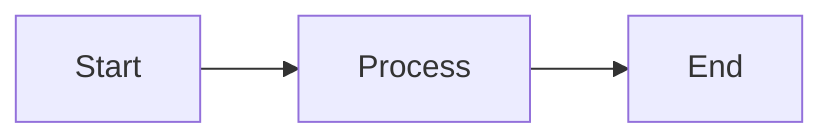

# Test Document

## Text Formatting

Normal **Bold** *Italic* ==Highlighted== ~~Strikethrough~~ `inline code` <u>Underline</u>

## Lists

- Item 1
- Item 2
  - Nested item
    - Deeply nested

## Checkboxes

### Basic
- [ ] Unchecked
- [x] Checked

### Action/Status
- [!] Important task
- [/] Currently working on this
- [d] Doing this right now
- [-] Dropped this idea
- [>] Forwarded to team

### Planning
- [?] Question to resolve
- [R] Research needed
- [i] Great idea!
- [B] Brainstorming session

### Evaluation
- [P] Pro: Works well
- [C] Con: Too expensive

### Documentation
- [N] Note to self
- [b] Bookmark this
- [E] Example case

## Callouts

> [!note] This is a note
> This is the content of the note

> [!warning] Warning
> Be careful here!

> [!success] Success
> Everything worked!

## Emojis

🍋😀🐶🐙🐍🎖️🏡

## Math

Inline math: $x = 3$ and $a^2 + b^2 = c^2$

Block math:
$$
\int_{a}^{b} f(x)dx
$$

## Code

```python
def hello():
    print("Hello, World!")
```

## Table

| Name | Age |
|------|-----|
| Alice | 25 |
| Bob | 30 |

## Mermaid Diagram



## Image Test

![https://static.iquesta.com/logo/iquesta/company/logo/10885.webp]