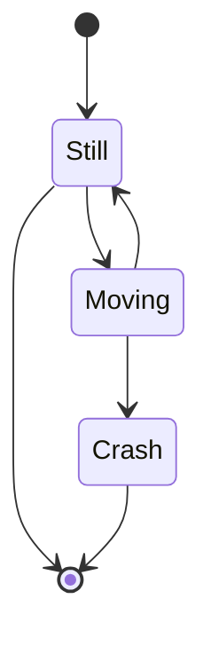

# Exemples

This file will contain different exemples of formatting, just to see whether the PDF generation works correctly.

---

## Lists

* List
* List
  * Embeded

1. List
2. List
	1. Embeded

---

## Checkboxes

* [ ] Tick box
* [x] Ticked box
  * [ ] Embeded Level 1 Tick box
  * [x]  Embeded Level 1 Ticked box
    * [ ] Embeded Level 2 Tick box
    * [x] Embeded Level 2 Ticked box
      * [ ] Embeded Level 3 Tick box

---

## Normal text

Some will contain formatting.

Lorem ipsum dolor sit amet, *consectetur adipiscing elit.* In **ultrices commodo metus**, non hendrerit metus ornare nec. ==Praesent ut quam lacus==. Curabitur lacus augue, ***malesuada mollis*** purus sed, efficitur convallis dui. Cras quam ligula, tincidunt aliquet est vitae, venenatis cursus nisl. Integer laoreet sit amet nulla in feugiat. Integer porttitor tincidunt nisl eu auctor. Nulla vitae odio sed diam elementum tempor ut vitae dolor. Sed vestibulum consectetur augue non euismod.

---

## Code Block

```text
Duis hendrerit risus lacus, interdum eleifend eros ultrices sodales. Suspendisse sit amet ultricies mi. Cras ut nisl massa. Mauris ut consectetur nibh. 
Mauris eros nunc, gravida quis faucibus vel, pharetra a dui. Nunc gravida turpis congue erat porta, at imperdiet urna scelerisque. 
Vestibulum faucibus sapien lacus, vel elementum quam tempor at. Nulla facilisi. Fusce eleifend magna quis leo iaculis, nec consectetur lectus interdum. Vivamus sit amet ultricies leo. Etiam semper eget nulla vel cursus. Integer posuere gravida purus, ut blandit dolor faucibus at. Cras tempor sapien non mauris commodo semper. Vestibulum eget nisl augue.
```

---

## Callout block

> [!INFO] Nullam sodales, leo ut mattis vulputate, diam dolor ullamcorper sem, et ornare mi mi a orci. 
> Phasellus rhoncus lorem nec urna aliquam placerat sit amet sit amet ligula. Quisque scelerisque, lacus et pellentesque pellentesque, libero mi posuere erat, sed fermentum neque nibh a est. Cras rutrum, lorem non dignissim molestie, quam risus facilisis nunc, at tincidunt massa magna non massa. Mauris pulvinar ipsum lectus, in interdum nisl molestie at. Nullam posuere euismod sem, eu luctus lacus auctor ut. Maecenas sollicitudin erat ex, non bibendum nunc aliquet et. Morbi tincidunt felis ante, at consectetur lorem consequat a. Morbi eget tincidunt arcu. Suspendisse auctor accumsan magna. Sed eget mauris dolor. Integer quis est eros. Aenean vel tellus vitae libero semper tincidunt vitae quis justo.

---

## Quotes

> Cras non commodo lorem. Etiam euismod erat eget nunc pellentesque, in semper justo pretium. Praesent porta suscipit viverra. Pellentesque eget lorem in dui finibus vestibulum. Morbi vehicula ac leo at vehicula. Pellentesque sit amet semper justo. Mauris sed porttitor turpis, non tincidunt urna. Aliquam et sem ac nisl accumsan fringilla non sit amet libero. Donec nisl dolor, posuere sed interdum ultricies, rhoncus at justo. Duis consectetur, velit vel imperdiet accumsan, turpis dui hendrerit elit, vel ornare enim dui quis tellus.

---

## Tables

|ID|Exemple|Text|
|--|--|--|
|0|Zero|Quisque nec risus sed est dignissim elementum. Vivamus eget rhoncus turpis. |
|1|One|Ut commodo nisl quis lacus mollis feugiat. Etiam rhoncus faucibus venenatis. Quisque vel sodales mi, posuere dignissim diam. Morbi suscipit, dui sed volutpat vestibulum, tellus lorem fermentum velit, eget vestibulum magna arcu eget urna. Donec vestibulum blandit posuere. Vestibulum sodales urna in odio cursus, vel tempus ex laoreet. Praesent sed ante ac libero condimentum sodales a vitae arcu. Praesent facilisis metus augue, eu lobortis elit vulputate vitae. Nulla interdum magna ac tristique tincidunt.|

---

## Mermaid Diagram



---

## Latex Math

This is an inline math expression $e^{2i\pi} = 1$.
It is used with a single \$ sign, exemples: $x = 3$ , $a^2 + b^2 = a^2 + ab + b^2$

$$\int_{a}^b\int_{c}^d f(x,y)dxdy$$

---
