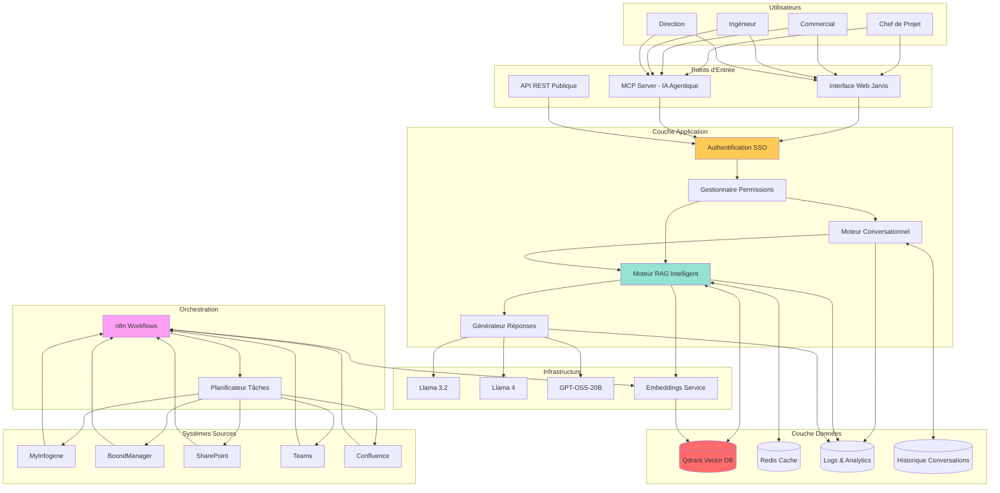
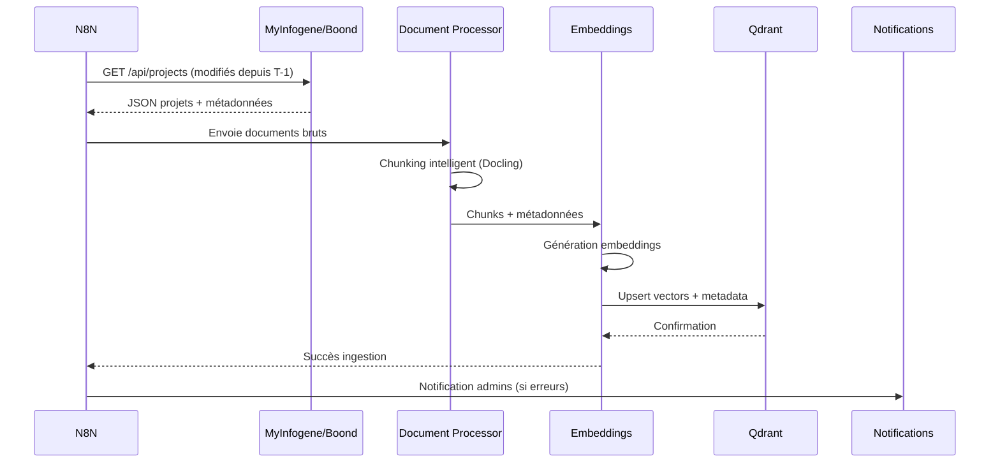
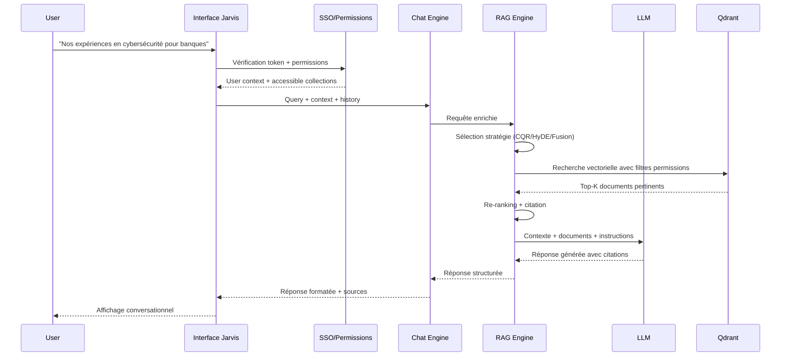
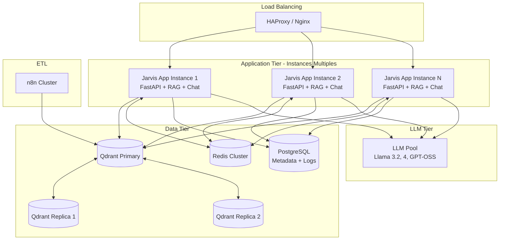
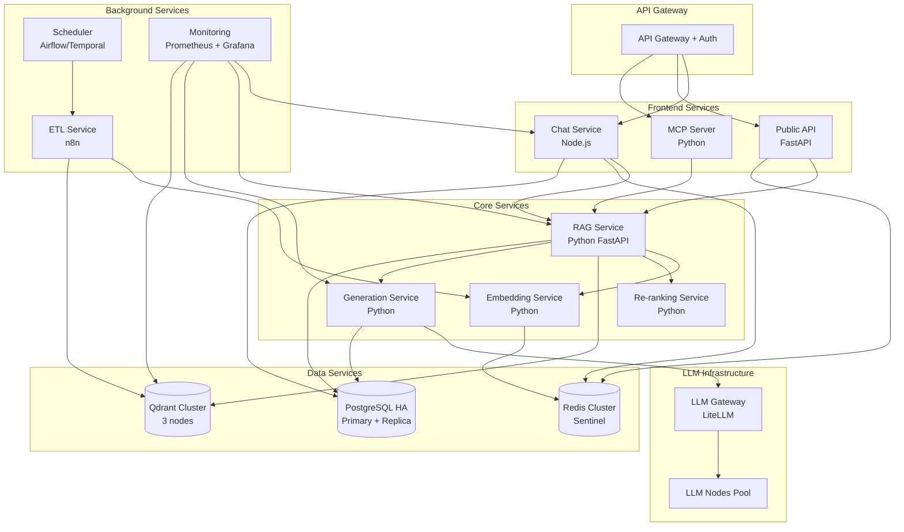
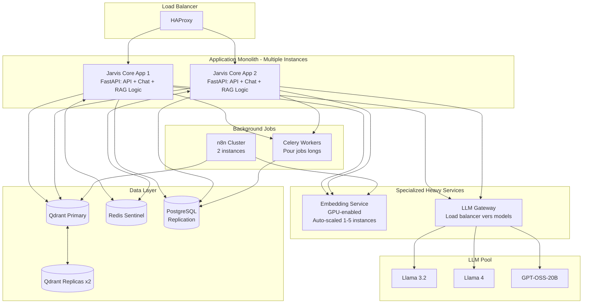

# Masterplan Jarvis - Dossier d'Architecture Fonctionnelle

**Date:** 2025-12-03  
**Version:** 1.0 - Draft  
**Owner:** Eric TAYLOR  
**Scope:** Système RAG intelligent pour automatisation réponses AO et valorisation expertise interne

**Nom de Projet:** PEPPER
Project Experience & Past PErformance Repository

---

## 1. Vision Stratégique et Objectifs

### 1.1 Problématique Métier

**Pain Points identifiés :**
- Temps excessif passé à rechercher les expériences pertinentes dans MyInfogene et BoondManager
- Reformulation manuelle et chronophage des références pour chaque AO
- Perte de connaissance lors des départs/mobilités
- Manque de capitalisation sur les succès passés
- Difficultés à croiser les expertises entre filiales/entités

**Impact Business :**
- Coût : ~2-3 jours par réponse AO en recherche et reformulation
- Qualité : références parfois incomplètes ou sous-optimales faute de temps
- Compétitivité : délais de réponse pénalisants sur appels d'offres rapides

### 1.2 Vision Cible

**Jarvis devient l'assistant IA qui :**
- Répond instantanément "Quelles sont nos expériences pertinentes sur [sujet X] pour [client Y] ?"
- Reformule automatiquement les expériences au bon niveau de détail selon le contexte
- Maintient à jour une base de connaissances vivante depuis nos systèmes source
- S'adapte aux permissions et aux périmètres métier de chaque utilisateur

**ROI Attendu :**
- Gain de temps : 60-80% sur la phase de recherche d'expériences (1.5-2 jours → 4-6h)
- Qualité : +30% de références exploitables par AO grâce à l'exhaustivité
- Réactivité : réponse aux demandes de pré-qualification en < 2h au lieu de 1-2 jours

---

## 2. Fonctionnalités Essentielles

### 2.1 Gestion des Collections Documentaires

| Fonction | Description | Priorité |
|----------|-------------|----------|
| **Ingestion automatique** | Connexion API vers MyInfogene, BoondManager, SharePoint, Teams | P0 |
| **Chunking intelligent** | Découpage sémantique des documents (Docling) | P0 |
| **Mise à jour incrémentale** | Synchronisation quotidienne/hebdomadaire des modifications | P0 |
| **Gestion des versions** | Historisation des changements avec traçabilité | P1 |
| **Détection de doublons** | Identification des contenus similaires | P1 |
| **Enrichissement métadonnées** | Extraction automatique tags, dates, acteurs, clients | P1 |
| **OCR avancé** | Reconnaissance texte dans images/PDF scannés | P2 |

### 2.2 Recherche et Récupération (RAG Core)

| Fonction | Description | Priorité |
|----------|-------------|----------|
| **Recherche sémantique** | Embedding + similarité vectorielle (Qdrant) | P0 |
| **Recherche hybride** | Combinaison sémantique + keyword + filtres métadonnées | P0 |
| **RAG Direct** | Récupération simple + LLM | P0 |
| **CQR (Contextual Query Reformulation)** | Reformulation requête selon contexte | P0 |
| **HyDE (Hypothetical Document Embeddings)** | Génération réponse hypothétique pour améliorer recherche | P1 |
| **Fusion RAG** | Combinaison multi-stratégies pour résultats optimaux | P1 |
| **Auto-sélection stratégie** | IA choisit automatiquement le meilleur pattern RAG | P1 |
| **Re-ranking** | Réordonnancement résultats par pertinence contextuelle | P1 |
| **Citation précise** | Référencement source avec numéros de page/section | P0 |

### 2.3 Génération et Reformulation

| Fonction | Description | Priorité |
|----------|-------------|----------|
| **Synthèse multi-sources** | Agrégation intelligente de plusieurs expériences | P0 |
| **Adaptation au contexte** | Reformulation selon type AO (public/privé, taille, secteur) | P0 |
| **Ajustement niveau détail** | Version executive summary vs. détaillée technique | P0 |
| **Multi-langue** | Support FR/EN natif, autres langues en P2 | P1 |
| **Respect templates** | Adaptation format selon modèles AO standards | P1 |
| **Anonymisation** | Masquage informations sensibles si requis | P2 |

### 2.4 Gestion des Permissions et Sécurité

| Fonction | Description | Priorité |
|----------|-------------|----------|
| **SSO Azure/Entra** | Authentification unique entreprise | P0 |
| **Collections publiques** | Visibles par tout le groupe | P0 |
| **Collections équipe** | Limitées aux membres Teams/AD groups | P0 |
| **Collections privées** | Accessibles uniquement au créateur | P0 |
| **Collections entité** | Périmètre filiale/société (Infogene, Vulcain, etc.) | P1 |
| **Héritage permissions** | Alignement sur droits sources (SharePoint, Teams) | P1 |
| **Audit trail** | Logs complets d'accès et d'utilisation | P0 |
| **Chiffrement au repos** | Données sensibles chiffrées dans Qdrant | P1 |
| **Filtrage automatique** | Utilisateur ne voit que ce qu'il a le droit de voir | P0 |

### 2.5 Expérience Utilisateur

| Fonction | Description | Priorité |
|----------|-------------|----------|
| **Interface Chat** | Conversation naturelle type ChatGPT | P0 |
| **Interface MCP** | Intégration dans outils agentiques (Claude, etc.) | P1 |
| **Suggestions auto** | Propositions de questions/recherches fréquentes | P1 |
| **Historique conversations** | Reprise contexte sessions précédentes | P0 |
| **Export résultats** | Word/PDF/Markdown avec mise en forme | P0 |
| **Feedback utilisateur** | Notation pertinence (👍👎) pour amélioration continue | P1 |
| **Mode "Quick Search"** | Recherche rapide sans conversation complète | P2 |

### 2.6 Administration et Monitoring

| Fonction | Description | Priorité |
|----------|-------------|----------|
| **Dashboard admin** | Vue d'ensemble utilisation, performance, santé système | P0 |
| **Gestion collections** | Création, modification, suppression par admins | P0 |
| **Monitoring temps réel** | Latence, disponibilité, erreurs | P0 |
| **Analytics usage** | Qui utilise quoi, quand, comment | P1 |
| **Gestion modèles LLM** | Switch entre Llama 3.2, Llama 4, GPT-OSS-20B | P1 |
| **Backup & Recovery** | Sauvegarde Qdrant, restauration rapide | P0 |
| **Scaling manuel/auto** | Ajout ressources selon charge | P1 |
| **Cost tracking** | Suivi coûts infrastructure et tokens | P2 |

### 2.7 Intégrations et Connecteurs

| Système Source | Type d'intégration | Données récupérées | Priorité |
|----------------|-------------------|-------------------|----------|
| **MyInfogene** | API REST | Projets, missions, compétences, CV | P0 |
| **BoondManager** | API REST | Opportunités, clients, propositions commerciales | P0 |
| **SharePoint** | MS Graph API | Documents techniques, présentations, rapports | P1 |
| **Teams** | MS Graph API | Conversations, décisions, fichiers partagés | P1 |
| **Confluence** | API REST | Documentation projets, wikis internes | P2 |
| **Jira** | API REST | Tickets, problèmes résolus, solutions techniques | P2 |
| **Email (Exchange)** | MS Graph API | Emails référents clients avec attachements | P2 |
| **n8n Workflows** | Webhook/API | Orchestration mises à jour et pipelines ETL | P0 |

---

## 3. Cartographie des Systèmes et Interfaces

### 3.1 Vue d'Ensemble de l'Écosystème

### 3.2 Flux de Données - Ingestion

### 3.3 Flux de Requête Utilisateur

### 3.4 Matrice des Interfaces

| Interface | Protocole | Authentification | Fréquence | Criticité |
|-----------|-----------|------------------|-----------|-----------|
| **MyInfogene → Jarvis** | REST API | OAuth 2.0 | Quotidien | Haute |
| **BoondManager → Jarvis** | REST API | API Key | Quotidien | Haute |
| **SharePoint → Jarvis** | MS Graph | Azure AD | Hebdo | Moyenne |
| **Teams → Jarvis** | MS Graph | Azure AD | Hebdo | Basse |
| **n8n → Jarvis** | Webhook | JWT | Temps réel | Haute |
| **Jarvis → Qdrant** | gRPC | Internal | Temps réel | Critique |
| **Jarvis → LLMs** | HTTP | Internal | Temps réel | Critique |
| **User → Jarvis** | HTTPS | SSO Azure | Temps réel | Critique |
| **MCP Server → Jarvis** | REST | Bearer Token | Temps réel | Haute |

---

## 4. Trois Architectures Proposées

### 4.1 Architecture A - "Monolithique Scalable"

**Principe:** Une application tout-en-un avec scaling horizontal classique.

**Avantages:**
- ✅ Simple à déployer et maintenir
- ✅ Faible latence (tout dans un process)
- ✅ Facile à déboguer
- ✅ Coût infrastructure réduit (peu de composants)

**Inconvénients:**
- ❌ Scaling limité (réplication complète à chaque instance)
- ❌ Difficulté à scale indépendamment RAG vs Chat vs API
- ❌ Risque de saturation si un composant consomme trop (ex: embeddings)
- ❌ Mise à jour = redéploiement complet

**Recommandé pour:**
- MVP et Phase 1 (< 100 utilisateurs simultanés)
- Équipe technique réduite
- Budget infrastructure contraint

**Capacité:**
- 50-150 utilisateurs simultanés
- ~1000 requêtes/jour
- SLA 99.5%

---

### 4.2 Architecture B - "Microservices Modulaires"

**Principe:** Découpage fonctionnel avec services indépendants et scaling granulaire.

**Avantages:**
- ✅ Scaling indépendant par service (ex: 5 instances RAG, 2 instances Chat)
- ✅ Haute disponibilité (panne d'un service ≠ panne totale)
- ✅ Évolutivité technologique (remplacer un service sans tout casser)
- ✅ Isolation des problèmes (bug dans Embedding ≠ bug dans Chat)
- ✅ Équipes peuvent travailler en parallèle sur services différents

**Inconvénients:**
- ❌ Complexité opérationnelle élevée
- ❌ Latence réseau entre services
- ❌ Nécessite orchestration Kubernetes
- ❌ Debugging plus complexe (traces distribuées requises)
- ❌ Coût infrastructure plus élevé

**Recommandé pour:**
- Phase 2-3 (> 200 utilisateurs)
- Équipe DevOps dédiée
- Besoin de scale à grande échelle
- Plusieurs équipes de développement

**Capacité:**
- 200-1000+ utilisateurs simultanés
- 10k-50k requêtes/jour
- SLA 99.9%

---

### 4.3 Architecture C - "Hybride Pragmatique"

**Principe:** Monolithe pour les fonctions principales + services spécialisés pour charges intensives.

**Avantages:**
- ✅ Équilibre complexité/performance
- ✅ Services lourds (Embeddings, LLM) isolés et scalables indépendamment
- ✅ Core app simple à maintenir
- ✅ Coûts maîtrisés (scale uniquement ce qui coûte cher)
- ✅ Migration progressive possible (monolithe → microservices)

**Inconvénients:**
- ⚠️ Nécessite quand même orchestration pour services spécialisés
- ⚠️ Complexité intermédiaire
- ⚠️ Risque de "monolithe qui grossit" si pas de discipline

**Recommandé pour:**
- Transition Phase 1 → Phase 2
- Équipe technique de taille moyenne
- Besoins de scaling progressif
- **→ Recommandation pour Infogene**

**Capacité:**
- 100-500 utilisateurs simultanés
- 5k-20k requêtes/jour
- SLA 99.7%

---

## 5. Comparaison et Recommandation

### 5.1 Matrice de Décision

| Critère | Architecture A Monolithique | Architecture B Microservices | Architecture C Hybride |
|---------|--------------------------------|----------------------------------|---------------------------|
| **Complexité déploiement** | ⭐⭐⭐⭐⭐ Très Simple | ⭐⭐ Complexe | ⭐⭐⭐⭐ Simple |
| **Scalabilité** | ⭐⭐⭐ Limitée | ⭐⭐⭐⭐⭐ Excellente | ⭐⭐⭐⭐ Bonne |
| **Coût infrastructure** | ⭐⭐⭐⭐⭐ Minimal | ⭐⭐ Élevé | ⭐⭐⭐⭐ Modéré |
| **Maintenabilité** | ⭐⭐⭐ Moyenne | ⭐⭐⭐⭐ Bonne | ⭐⭐⭐⭐ Bonne |
| **Performance** | ⭐⭐⭐⭐ Bonne | ⭐⭐⭐⭐ Bonne | ⭐⭐⭐⭐⭐ Excellente |
| **Temps de mise en œuvre** | ⭐⭐⭐⭐⭐ Rapide (1-2 mois) | ⭐⭐ Long (4-6 mois) | ⭐⭐⭐⭐ Raisonnable (2-3 mois) |
| **Compétences requises** | ⭐⭐⭐⭐ Basiques | ⭐⭐ Avancées (K8s) | ⭐⭐⭐ Intermédiaires |
| **Haute disponibilité** | ⭐⭐⭐ Moyenne | ⭐⭐⭐⭐⭐ Excellente | ⭐⭐⭐⭐ Bonne |
| **Évolutivité future** | ⭐⭐ Limitée | ⭐⭐⭐⭐⭐ Illimitée | ⭐⭐⭐⭐ Très bonne |

### 5.2 Recommandation : Architecture C - Hybride Pragmatique

**Justification:**

1. **Aligné avec la maturité actuelle**
   - Équipe AI actuelle : 1 Lead Dev + 2 apprentis (disponibilité alternée)
   - Infrastructure existante : Docker Compose → Migration progressive possible
   - Pas besoin de Kubernetes expertise immédiate

2. **Répond aux besoins business**
   - Peut gérer 100-500 utilisateurs (objectif 2025-2026)
   - SLA 99.7% suffisant pour usage interne
   - Performance excellente pour cas d'usage AO (latence critique)

3. **Optimise les coûts**
   - Services lourds (Embeddings GPU) scalent indépendamment
   - Pas de surcoût microservices complet
   - Possibilité d'optimiser selon utilisation réelle

4. **Permet l'évolution**
   - Migration vers microservices possible si besoin (Phase 3)
   - Core app reste simple pendant scale-up
   - Découplage services coûteux = flexibilité budgétaire

**Prérequis techniques:**
- Docker Swarm OU Kubernetes léger (k3s) pour orchestration
- Qdrant en cluster (minimum 3 nodes)
- Redis Sentinel pour cache HA
- PostgreSQL avec replication (Primary + 1 Replica)
- Monitoring Prometheus + Grafana

---

## 6. Roadmap d'Implémentation

### Phase 1 - MVP Fonctionnel (Q1 2025 - 3 mois)

**Objectifs:**
- Système RAG opérationnel sur MyInfogene et BoondManager
- Interface Chat basique
- Collections publiques et privées
- Authentification SSO

**Deliverables:**
- ✅ Architecture C déployée en mode simplifié (sans scaling automatique)
- ✅ Connecteurs MyInfogene + BoondManager opérationnels
- ✅ RAG Direct + CQR fonctionnels
- ✅ Interface Web Streamlit/Gradio
- ✅ Qdrant 3-nodes cluster
- ✅ Authentification Azure AD
- ✅ 10-20 utilisateurs pilotes (équipe pré-vente)

**Ressources:**
- Lead Dev : architecture + RAG core
- Dev 1 : n8n pipelines + connecteurs API
- Dev 2 : Frontend + Auth SSO
- Eric : Product Owner + tests utilisateurs

### Phase 2 - Enrichissement et Scale (Q2-Q3 2025 - 4 mois)

**Objectifs:**
- Stratégies RAG avancées (HyDE, Fusion)
- Collections par équipes Teams
- MCP Server pour IA agentique
- Intégrations SharePoint/Teams
- Scaling automatique composants critiques

**Deliverables:**
- ✅ Auto-sélection stratégie RAG par IA
- ✅ Permissions granulaires via Azure/Entra
- ✅ Collections équipes synchronisées avec Teams
- ✅ Interface MCP opérationnelle
- ✅ Connecteurs SharePoint + Teams
- ✅ Auto-scaling Embedding Service (1-5 instances)
- ✅ 50-100 utilisateurs actifs

**Ressources:**
- Lead Dev : RAG avancé + MCP
- Dev 1 : Permissions + connecteurs MS Graph
- Dev 2 : Scaling + monitoring
- + 1 DevOps externe (3 mois) pour infra scaling

### Phase 3 - Production et Groupe (Q4 2025 - 3 mois)

**Objectifs:**
- Rollout toutes filiales Vulcain
- Collections par entité juridique
- Interface production Vue.js
- Intégrations Confluence/Jira
- SLA 99.9%

**Deliverables:**
- ✅ Multi-tenancy par filiale
- ✅ Interface Vue.js production
- ✅ Connecteurs Confluence + Jira
- ✅ Dashboard analytics avancés
- ✅ Documentation complète
- ✅ Formation utilisateurs (10 sessions)
- ✅ 200-300 utilisateurs groupe

**Ressources:**
- Équipe AI complète
- + 1 DevOps permanent
- + Support formation/change management

### Jalons Critiques

| Jalon | Date Cible | Critère de Succès |
|-------|-----------|-------------------|
| **POC validé** | Fin Janvier 2025 | 5 réponses AO réussies avec Jarvis |
| **MVP Production** | Fin Mars 2025 | 20 utilisateurs quotidiens, SLA > 99% |
| **Scale Infogene** | Fin Juin 2025 | 100 utilisateurs, 500 requêtes/jour |
| **Rollout Groupe** | Fin Décembre 2025 | 300 utilisateurs, 2000 requêtes/jour |

---

## 7. Risques et Mitigations

| Risque | Probabilité | Impact | Mitigation |
|--------|-------------|--------|------------|
| **Disponibilité équipe** (apprentis alternance) | Haute | Moyen | Planning ajusté sur semaines présence, documentation exhaustive |
| **Performance Qdrant** (volumétrie MyInfogene) | Moyenne | Haute | Benchmark dès POC, plan B vers Weaviate/Milvus |
| **Qualité connecteurs API** (changements MyInfogene) | Moyenne | Haute | Versioning API, tests automatisés, fallback manuel |
| **Latence LLM** (charge simultanée) | Moyenne | Moyenne | Queue system (Celery), cache Redis agressif |
| **Complexité permissions** (matrice entités/équipes) | Haute | Haute | Phase par phase (Publique → Privée → Équipe → Entité) |
| **Adoption utilisateurs** | Moyenne | Haute | Change management, formation, quick wins visibles |

---

## 8. Budget Prévisionnel (Architecture C)

### Infrastructure Année 1

| Poste | Coût Mensuel | Coût Annuel | Note |
|-------|--------------|-------------|------|
| **Serveurs Application** (2x 16 vCPU, 64GB RAM) | 800€ | 9,600€ | On-prem ou VM dédiées |
| **Serveur Embeddings** (1x GPU T4, 32GB RAM) | 600€ | 7,200€ | Scaling 1-5 selon charge |
| **Cluster Qdrant** (3x 8 vCPU, 32GB RAM, SSD 500GB) | 900€ | 10,800€ | |
| **Redis + PostgreSQL** (HA) | 300€ | 3,600€ | |
| **Monitoring** (Prometheus, Grafana, logs) | 200€ | 2,400€ | |
| **Backup & Storage** (2TB) | 150€ | 1,800€ | |
| **Total Infrastructure** | **2,950€/mois** | **35,400€/an** | |

### Licences et Services

| Poste | Coût Annuel |
|-------|-------------|
| **n8n Self-Hosted** | 0€ (OSS) |
| **Qdrant** | 0€ (OSS) |
| **Azure AD/Entra** (SSO) | Inclus licences M365 |
| **API MyInfogene** | 0€ (interne) |
| **API BoondManager** | 0€ (existant) |

### Ressources Humaines Année 1

| Poste | Coût |
|-------|------|
| **Lead Dev** (fulltime) | Budget RH existant |
| **Dev 1 + Dev 2** (apprentis alternance) | Budget RH existant |
| **DevOps externe** (3 mois, Phase 2) | 25,000€ |
| **Formation & Change Mgmt** | 10,000€ |
| **Total RH additionnel** | **35,000€** |

**Budget Total Année 1: ~70,000€**

---

## 9. Indicateurs de Performance (KPIs)

### KPIs Techniques

| Métrique | Cible MVP | Cible Production |
|----------|-----------|------------------|
| **Latence moyenne requête simple** | < 1s | < 500ms |
| **Latence requête complexe** (multi-docs) | < 3s | < 2s |
| **Disponibilité système** | 99.5% | 99.7% |
| **Temps indexation 1000 documents** | < 15 min | < 10 min |
| **Précision RAG** (pertinence top-3) | > 70% | > 85% |
| **Taux d'erreur** | < 1% | < 0.5% |

### KPIs Business

| Métrique | Cible Année 1 |
|----------|---------------|
| **Utilisateurs actifs mensuels** | 150 |
| **Requêtes par utilisateur/semaine** | 10 |
| **Gain temps recherche AO** | 60% (2j → 0.8j) |
| **Taux satisfaction utilisateurs** | > 4/5 |
| **Nombre AO soutenus** | 50 |
| **ROI perçu** | Positif sur 80% utilisateurs |

---

## 10. Prochaines Étapes

### Semaine 1-2 (Décembre 2025)
- [ ] Validation DAF par Direction
- [ ] Commande matériel (GPU, serveurs si nécessaire)
- [ ] Kick-off projet avec équipe élargie
- [ ] Setup environnement développement

### Semaine 3-4 (Décembre-Janvier)
- [ ] Architecture détaillée technique
- [ ] POC connecteur MyInfogene
- [ ] Setup Qdrant cluster
- [ ] Premiers tests RAG sur données réelles

### Janvier 2025
- [ ] Sprint 1 : Connecteurs MyInfogene + BoondManager
- [ ] Sprint 2 : RAG Direct + CQR
- [ ] Sprint 3 : Interface Chat basique
- [ ] Sprint 4 : SSO + Collections publiques/privées

### Février 2025
- [ ] Tests internes équipe AI
- [ ] Pilote 10 utilisateurs pré-vente
- [ ] Ajustements feedback
- [ ] Préparation communication interne

### Mars 2025
- [ ] Lancement MVP production
- [ ] Formation 20 premiers utilisateurs
- [ ] Monitoring intensif
- [ ] Planification Phase 2

---

**Document préparé par:** Eric TAYLOR, CAIO Infogene  
**Dernière mise à jour:** 2025-12-03  
**Statut:** Draft v1.0 - En attente validation

**Contacts:**
- Architecture : Eric TAYLOR
- Développement : [Lead Dev Name]
- Infrastructure : [DevOps Contact]

---

## Annexes

### A. Glossaire

- **RAG (Retrieval-Augmented Generation)** : Technique combinant recherche documentaire et génération par LLM
- **CQR (Contextual Query Reformulation)** : Reformulation automatique requête selon contexte
- **HyDE (Hypothetical Document Embeddings)** : Génération réponse hypothétique pour améliorer recherche
- **Fusion RAG** : Combinaison de plusieurs stratégies RAG
- **Embedding** : Représentation vectorielle d'un texte
- **Qdrant** : Base de données vectorielle open-source
- **MCP (Model Context Protocol)** : Protocole pour connexion IA agentique

### B. Références Techniques

- Docling: https://github.com/DS4SD/docling
- Qdrant: https://qdrant.tech/
- n8n: https://n8n.io/
- FastAPI: https://fastapi.tiangolo.com/
- LiteLLM: https://github.com/BerriAI/litellm

### C. Standards et Normes

- RGPD : Compliance totale via on-premise et SSO
- ISO 27001 : Audit trail, chiffrement, gestion permissions
- Accessibilité WCAG 2.1 : Interface web conforme niveau AA

