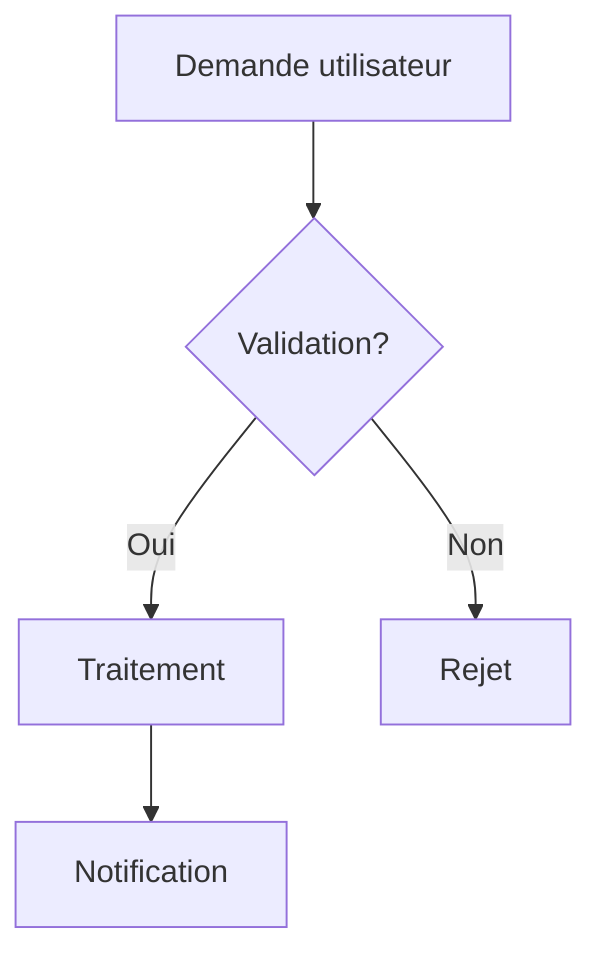
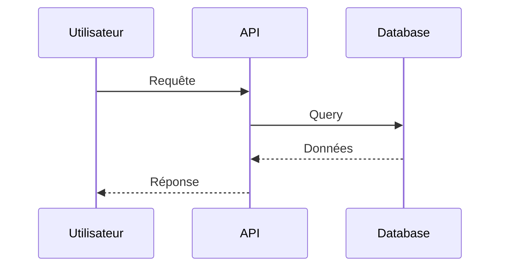
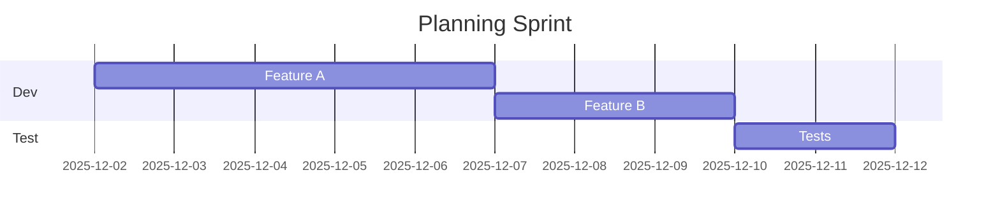
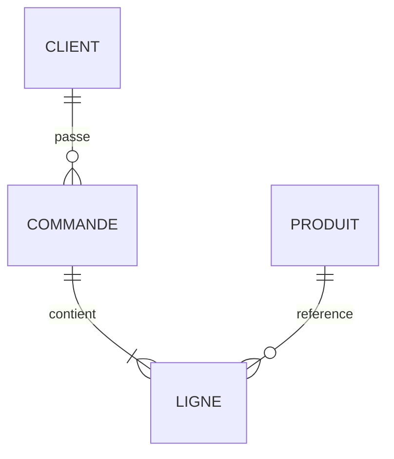

# Intégration de Mermaid dans Jira/Confluence

**À l'attention de :** Responsables Méthodologie (Xavier Guilminot) et Jira/Confluence (Baptiste Movrel)
**De :** Eric Taylor
**Date :** 2 décembre 2025

## Objectif

Intégrer un interpréteur de diagrammes Mermaid dans notre EDM Jira/Confluence pour améliorer la documentation technique et la collaboration d'équipe.

## Pourquoi Mermaid ?

Mermaid permet de créer des diagrammes directement en texte, sans outils externes. Avantages principaux :

- **Versionnable** : Les diagrammes en texte suivent le cycle de versionnage
- **Maintenable** : Modifications simples sans logiciel graphique
- **Collaboratif** : Édition directe dans Confluence, révision dans Jira
- **Léger** : Pas de fichiers images lourds à gérer
- **Standardisé** : Syntaxe markdown reconnue par l'industrie

## Bénéfices pour les équipes

### Équipes Dev/Tech
- Documentation d'architecture à jour
- Diagrammes de flux techniques intégrés au code review
- Schémas de base de données dans les specs

### Équipes Projet/Product
- Workflows visuels dans les user stories
- Gantt charts pour le planning
- Diagrammes de décision dans la documentation

### Tous
- Réduction du temps de création de diagrammes (-70%)
- Diminution des outils externes nécessaires
- Meilleure cohérence visuelle

## Exemples de diagrammes courants

### 1. Diagramme de flux (Flowchart)

**Usage :** Processus métier, workflows d'approbation, parcours utilisateur

### 2. Diagramme de séquence

**Usage :** Interactions système, API flows, communication microservices

### 3. Diagramme de Gantt

**Usage :** Planification de sprint, roadmap produit, jalons projet

### 4. Diagramme d'entités (ERD)

**Usage :** Modèles de données, architecture BDD, specs techniques

## Mise en œuvre recommandée

1. **Confluence** : Plugin natif "Mermaid Diagrams" disponible sur Marketplace
2. **Jira** : Macro Mermaid dans les descriptions et commentaires
3. **Formation** : Session 30min pour les équipes (syntaxe basique)

## Prochaines étapes

- [ ] Installation en environnement de test
- [ ] Pilote avec 2-3 équipes volontaires
- [ ] Déploiement généralisé

---

**Contact :** Pour questions ou démonstration détaillée : Eric Taylor
